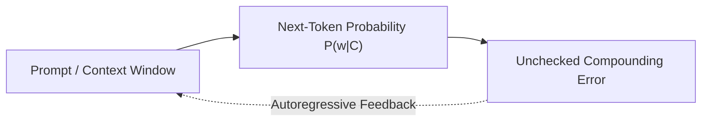
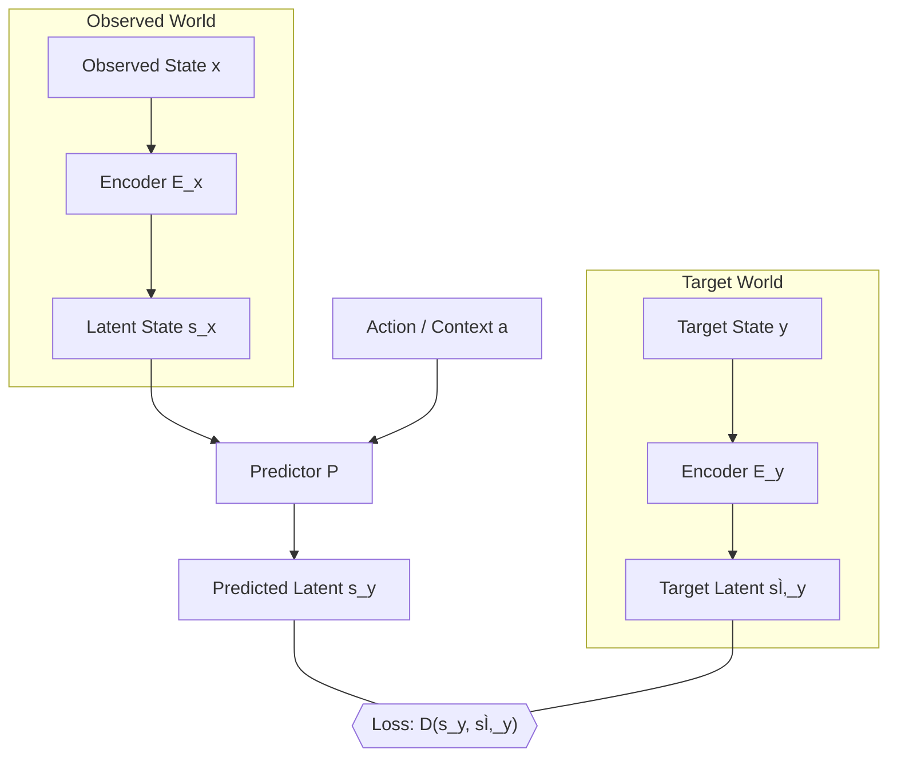
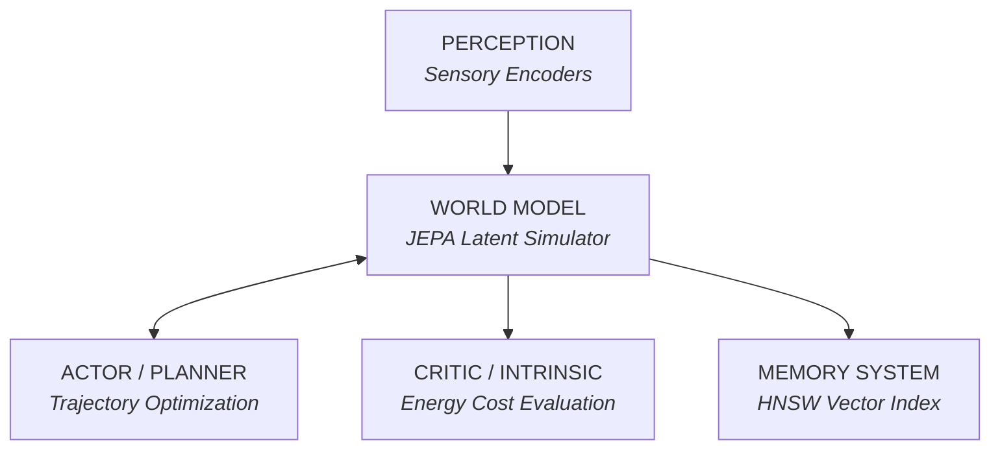

## 01. The AGI Scaling Fallacy

Over the past three years, public and venture discourse surrounding Artificial General Intelligence (AGI) has converged on a singular dogma: that scaling autoregressive Large Language Models (LLMs) with more parameters, more compute, and larger crawl dumps will inexorably produce human-level cognition.

Turing Award winner and Meta Chief AI Scientist **Yann LeCun** presents a contrarian mathematical reality: **autoregressive token prediction cannot achieve human-level intelligence, common sense, or physical reasoning.**

Why? Because language is merely a tiny, compressed, lossy projection of physical reality. To build machines that truly understand the world, we must abandon next-token prediction and build **Joint Embedding Predictive Architectures (JEPA)**.

---

## 02. The Sensory Bandwidth Paradox

The fundamental limitation of LLMs is not compute, it is **information bandwidth**:

```mermaid
flowchart TD
    subgraph LLM ["AUTOREGRESSIVE LLM"]
        direction TB
        L1["Ingests ~10¹² bytes text (Internet crawl)"]
        L2["Masters syntax & token prediction"]
        L3["Symbol Grounding: 0%"]
    end
    subgraph Infant ["BIOLOGICAL INFANT (4 Years Old)"]
        direction TB
        I1["Ingests ~10¹� bytes vision (~20 MB/s)"]
        I2["Learns intuitive physics & causality"]
        I3["Symbol Grounding: 100%"]
    end
```

$$\text{Data}_{\text{Child}} \gg 100 \times \text{Data}_{\text{Internet Text}}$$

A four-year-old child has seen $100\times$ more data through the optic nerve than all the text tokens ingested by GPT-4.

Before a toddler speaks their first grammatical sentence, they have already developed a comprehensive **world model**:

- **Intuitive Physics**: Knowing that objects fall, liquids pour, and solid barriers cannot be walked through.
- **Spatial Continuity & Object Permanence**: Recognizing that an occluded ball still exists behind a screen.
- **Cause-and-Effect & Counterfactuals**: Predicting that pushing a glass off a table will cause it to shatter.

LLMs attempt the inverse: mastering surface-level grammar without ever grounding symbols in physical reality.

---

## 03. The Mathematics of Autoregressive Error Compounding

An autoregressive language model decomposes probability across a sequence of tokens using the chain rule:

$$P(w_1, w_2, \dots, w_T) = \prod_{t=1}^{T} P(w_t \mid w_1, \dots, w_{t-1})$$

At each generation step $t$, the predicted token $\hat{w}_t$ is appended back into the input context as absolute ground truth.

If the probability of producing an error at step $t$ is $\epsilon$, the probability of a completely correct $N$-step logical chain decays exponentially:

$$P(\text{Valid Plan}) = (1 - \epsilon)^N$$

Because LLMs have no internal world simulator to evaluate whether intermediate steps are physically plausible, errors accumulate monotonically. This is why LLMs can generate fluid poetry yet fail at simple spatial navigation or multi-step chess puzzles without search trees.

---

## 04. Joint Embedding Predictive Architecture (JEPA)

To overcome the scaling limits of autoregression, Yann LeCun proposed **JEPA (Joint Embedding Predictive Architecture)**.

Unlike generative models (which try to reconstruct every irrelevant background pixel or word), JEPA predicts in **abstract representation space**.

Instead of asking: _"What is the exact value of pixel $(x, y)$ in frame $t+1$?"_, JEPA asks:

> _"What is the high-level semantic vector $\mathbf{s}_y$ describing the state of the world after action $\mathbf{a}$?"_

### Preventing Representation Collapse via VICReg

The major mathematical challenge in non-generative self-supervised learning is preventing **representation collapse** (where the encoder maps all inputs to a constant zero vector).

LeCun and his team resolve this via **VICReg (Variance-Invariance-Covariance Regularization)**:

$$\mathcal{L}_{\text{VICReg}} = \lambda s(\mathbf{Z}) + \mu v(\mathbf{Z}) + \nu c(\mathbf{Z})$$

1. **Invariance ($s$):** Enforces that representations of identical scenes under different augmentations remain close.
2. **Variance ($v$):** Forces the variance along each embedding dimension across the batch to remain above a threshold $\gamma$, preventing collapse.
3. **Covariance ($c$):** Decorrelates dimensions, maximizing the information capacity of the latent space $\mathbb{R}^D$.

---

## 05. The 6-Module Architecture for Autonomous Machine Intelligence

LeCun's blueprint for autonomous agents replaces single-prompt LLM wrappers with a modular cognitive system:

1. **Perception Module:** Encoders extracting abstract representations from continuous video, audio, and proprioception.
2. **World Model (JEPA):** Predicts future world states conditioned on hypothetical candidate actions.
3. **Memory Module:** Associative vector memory storing episodic experiences and world states.
4. **Intrinsic Cost Module (Critic):** Evaluates whether a predicted trajectory satisfies internal drives (safety, goal completion, energy efficiency).
5. **Configurator:** Allocates compute and dynamically reconfigures sub-modules for current goals.
6. **Actor:** Uses gradient-based optimization or model-predictive control (MPC) to select the action sequence that minimizes the Critic's cost.

---

## 06. The Path Forward: Video Over Text

The thesis is clear:

1. **Next-Token Prediction is a Local Optimum:** It yields extraordinary language interfaces, but cannot reason, plan, or understand cause-and-effect.
2. **Self-Supervised Video Learning is the Path:** Ingesting continuous video through V-JEPA bridges the $10^{14}\text{ bytes}$ bandwidth gap.
3. **True Intelligence Requires Latent World Models:** Planning through energy-based cost functions in continuous representation space is how machines will finally learn common sense.

True machine intelligence will not be achieved by predicting the next word—it will be achieved by understanding the physical world.
