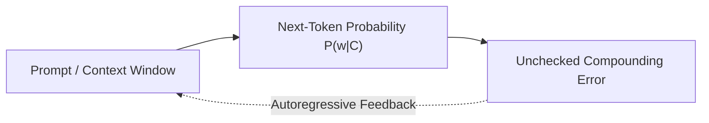
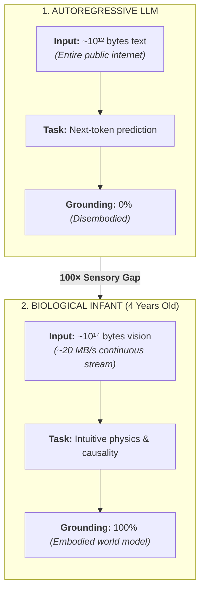
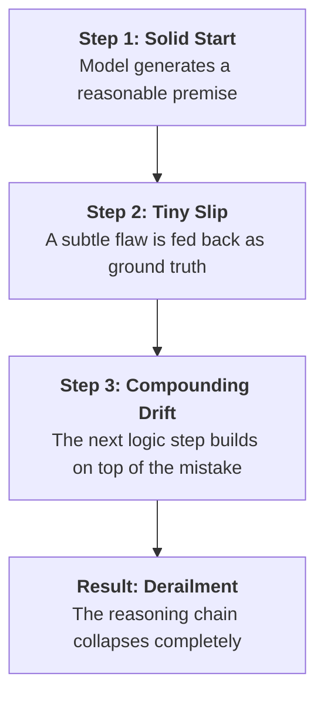
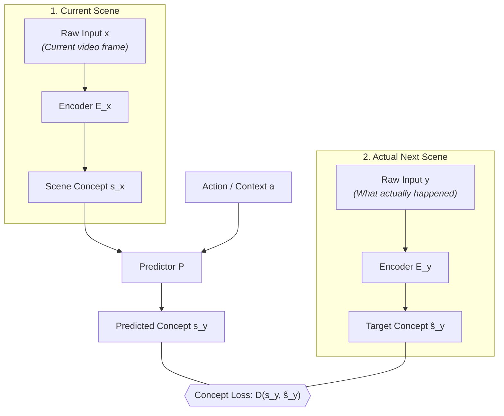
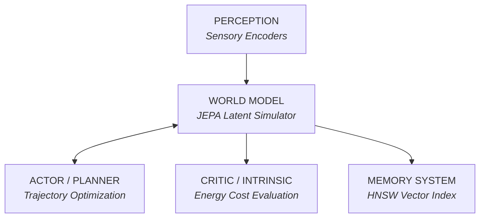

## 01. The AGI Scaling Fallacy

Over the past three years, public and venture discourse surrounding Artificial General Intelligence (AGI) has converged on a singular dogma: that scaling autoregressive Large Language Models (LLMs) with more parameters, more compute, and larger crawl dumps will inexorably produce human-level cognition.

Turing Award winner and Meta Chief AI Scientist **Yann LeCun** presents a contrarian mathematical reality: **autoregressive token prediction cannot achieve human-level intelligence, common sense, or physical reasoning.**

```mermaid
flowchart LR
    A["Prompt / Context Window"] --> B["Next-Token Probability P(w|C)"]
    B --> C["Unchecked Compounding Error"]
    C -.->|"Autoregressive Feedback"| A
```

Why? Because language is merely a tiny, compressed, lossy projection of physical reality. To build machines that truly understand the world, we must abandon next-token prediction and build **Joint Embedding Predictive Architectures (JEPA)**.

---

## 02. The Sensory Bandwidth Paradox

The fundamental limitation of LLMs is not compute, it is **information bandwidth**:

```mermaid
flowchart TD
    subgraph LLM ["1. AUTOREGRESSIVE LLM"]
        direction TB
        L1["<b>Input:</b> ~10¹² bytes text<br/><i>(Entire public internet)</i>"]
        L2["<b>Task:</b> Next-token prediction"]
        L3["<b>Grounding:</b> 0% <i>(Disembodied)</i>"]
        L1 --> L2 --> L3
    end

    LLM -->|<b>100× Sensory Gap</b>| INF

    subgraph INF ["2. BIOLOGICAL INFANT (4 Years Old)"]
        direction TB
        I1["<b>Input:</b> ~10¹⁴ bytes vision<br/><i>(~20 MB/s continuous stream)</i>"]
        I2["<b>Task:</b> Intuitive physics & causality"]
        I3["<b>Grounding:</b> 100% <i>(Embodied world model)</i>"]
        I1 --> I2 --> I3
    end
```

$$\text{Data}_{\text{Child}} \gg 100 \times \text{Data}_{\text{Internet Text}}$$

A four-year-old child has seen $100\times$ more data through the optic nerve than all the text tokens ingested by GPT-4.

Before a toddler speaks their first grammatical sentence, they have already developed a comprehensive **world model**:

- **Intuitive Physics**: Knowing that objects fall, liquids pour, and solid barriers cannot be walked through.
- **Spatial Continuity & Object Permanence**: Recognizing that an occluded ball still exists behind a screen.
- **Cause-and-Effect & Counterfactuals**: Predicting that pushing a glass off a table will cause it to shatter.

LLMs attempt the inverse: mastering surface-level grammar without ever grounding symbols in physical reality.

---

## 03. Why Errors Snowball in Long Reasoning Chains

Language models generate text one word at a time. Every new guess is fed right back into the model as absolute fact. In multi-step reasoning, this creates a compounding tightrope effect:

```mermaid
flowchart TD
    S1["<b>Step 1: Solid Start</b><br/>Model generates a reasonable premise"]
    S2["<b>Step 2: Tiny Slip</b><br/>A subtle flaw is fed back as ground truth"]
    S3["<b>Step 3: Compounding Drift</b><br/>The next logic step builds on top of the mistake"]
    S4["<b>Result: Derailment</b><br/>The reasoning chain collapses completely"]

    S1 --> S2 --> S3 --> S4
```

Because the model has no mental world simulator to fact-check intermediate steps against physical reality, it never notices when it has drifted off course. It simply doubles down until the entire answer falls apart.

---

## 04. Joint Embedding Predictive Architecture (JEPA)

To move past the limits of word-by-word prediction, Yann LeCun proposed **JEPA (Joint Embedding Predictive Architecture)**.

Traditional generative AI wastes massive amounts of compute trying to recreate every tiny detail: every blade of grass blowing in the wind, every background shadow, or every single pixel. Humans don't think like this. If you watch a car turn a corner, you don't predict how the texture of the asphalt changes under its tires. You simply predict that the car is now on the next street.

JEPA does exactly that: it predicts only the **meaning** of what comes next in an abstract concept space, ignoring irrelevant noise.

```mermaid
flowchart TD
    subgraph Current ["1. Current Scene"]
        X["Raw Input x<br/><i>(Current video frame)</i>"] --> EX["Encoder E_x"]
        EX --> SX["Scene Concept s_x"]
    end

    subgraph Future ["2. Actual Next Scene"]
        Y["Raw Input y<br/><i>(What actually happened)</i>"] --> EY["Encoder E_y"]
        EY --> SY["Target Concept ŝ_y"]
    end

    SX --> P["Predictor P"]
    A["Action / Context a"] --> P
    P --> PSY["Predicted Concept s_y"]

    PSY --- LOSS{{"Concept Loss: D(s_y, ŝ_y)"}}
    SY --- LOSS
```

Instead of asking: _"What is the exact color of pixel $(x, y)$ in the next second?"_, JEPA asks:

> _"What will the scene actually mean once action $\mathbf{a}$ takes place?"_

### Preventing Representation Collapse via VICReg

When a model only compares concepts instead of generating full images, it can easily find a lazy shortcut: assign every input the exact same number (like zero). Mathematically, all predictions match perfectly, but the model learns nothing useful. This failure mode is known as **representation collapse**.

To prevent this shortcut while keeping the system non-generative, LeCun's team uses **VICReg (Variance-Invariance-Covariance Regularization)**:

$$\mathcal{L}_{\text{VICReg}} = \lambda s(\mathbf{Z}) + \mu v(\mathbf{Z}) + \nu c(\mathbf{Z})$$

VICReg sets up three mathematical guardrails:

1. **Invariance ($s$):** If the same object appears from slightly different viewpoints or lighting conditions, its core representation must stay close together in latent space.
2. **Variance ($v$):** Prevents the model from collapsing into a flat line by forcing the variance along each embedding dimension to stay above a threshold $\gamma$.
3. **Covariance ($c$):** Keeps dimensions independent from one another, preventing the network from repeating the same features across multiple channels and maximizing information capacity across $\mathbb{R}^D$.

---

## 05. The 6-Module Architecture for Autonomous Machine Intelligence

LeCun's blueprint for autonomous agents replaces single-prompt LLM wrappers with a modular cognitive system:

```mermaid
flowchart TD
    P["PERCEPTION<br/><i>Sensory Encoders</i>"] --> WM["WORLD MODEL<br/><i>JEPA Latent Simulator</i>"]
    WM <--> A["ACTOR / PLANNER<br/><i>Trajectory Optimization</i>"]
    WM --> C["CRITIC / INTRINSIC<br/><i>Energy Cost Evaluation</i>"]
    WM --> M["MEMORY SYSTEM<br/><i>HNSW Vector Index</i>"]
```

1. **Perception Module:** Encoders extracting abstract representations from continuous video, audio, and proprioception.
2. **World Model (JEPA):** Predicts future world states conditioned on hypothetical candidate actions.
3. **Memory Module:** Associative vector memory storing episodic experiences and world states.
4. **Intrinsic Cost Module (Critic):** Evaluates whether a predicted trajectory satisfies internal drives (safety, goal completion, energy efficiency).
5. **Configurator:** Allocates compute and dynamically reconfigures sub-modules for current goals.
6. **Actor:** Uses gradient-based optimization or model-predictive control (MPC) to select the action sequence that minimizes the Critic's cost.

---

## 06. The Path Forward: Video Over Text

The thesis is clear:

1. **Next-Token Prediction is a Local Optimum:** It yields extraordinary language interfaces, but cannot reason, plan, or understand cause-and-effect.
2. **Self-Supervised Video Learning is the Path:** Ingesting continuous video through V-JEPA bridges the $10^{14}\text{ bytes}$ bandwidth gap.
3. **True Intelligence Requires Latent World Models:** Planning through energy-based cost functions in continuous representation space is how machines will finally learn common sense.

True machine intelligence will not be achieved by predicting the next word: it will be achieved by understanding the physical world.
