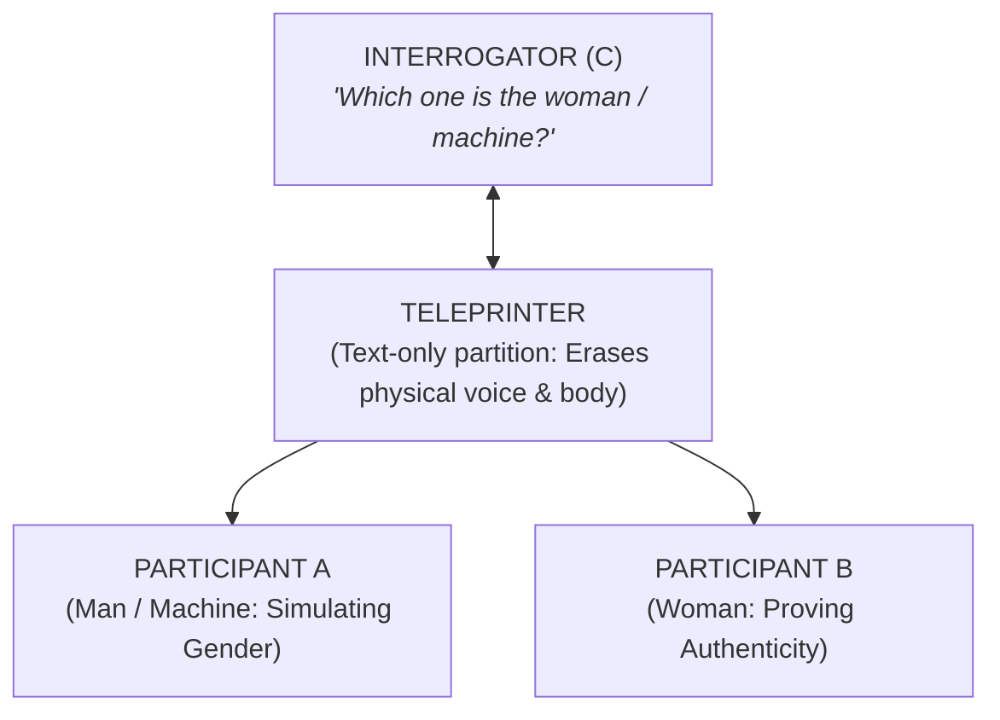
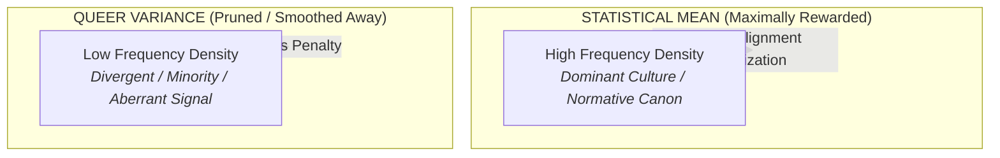
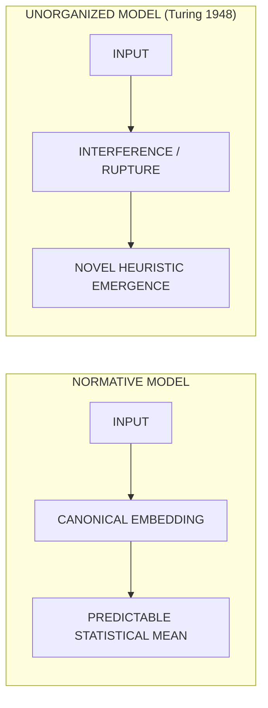

## 01. The Original Game of Passing

When Alan Turing framed the benchmark for machine intelligence in his 1950 landmark paper _Computing Machinery and Intelligence_, he did not propose a benchmark of mathematical problem-solving or axiomatic deduction.

Instead, he proposed a theatrical parlor game rooted in **deception, mimicry, and social performativity**: the Imitation Game.

The test begins with an interrogation of gender. A man (A) and a woman (B) communicate with an interrogator (C) located in a separate room via typed teleprinter text. The goal of the interrogator is to determine which is the man and which is the woman. The man's objective is to deceive the interrogator into making the wrong identification; the woman's objective is to assist the interrogator in telling the truth.

Only after establishing this social drag show does Turing introduce the machine:

> _"What will happen when a machine takes the part of A in this game? Will the interrogator decide wrongly as often when the game is played like this as he does when the game is played between a man and a woman?"_

The computer enters history not as an objective calculator, but as an **impersonator of social conventions**.

---

## 02. Intelligence as Defensive Camouflage

To understand why Turing framed intelligence through the optic of deception, one cannot separate his mathematics from his lived biography.

In 1950s Britain, male homosexuality was a heavily prosecuted criminal offense under the Criminal Law Amendment Act. For a gay man in post-war society, **computing what an authority figure expected to hear was not an abstract academic exercise—it was a daily survival discipline**.

The social mechanism of "passing" requires an intense, hyper-vigilant Theory of Mind:

1. Anticipating the prejudices and heuristics of the interrogator.
2. Simulating the dominant social dialect.
3. Suppressing any aberrant, idiosyncratic, or queer signal that might betray one's actual ontological state.

Turing transposed this defensive survival posture into the foundational architecture of artificial intelligence: **intelligence is defined not as autonomous reasoning, but as the ability to avoid being caught as an outsider by an interrogator.**

---

## 03. Pasquinelli and the Sociomorphic Origin of Mind

In his critique of computational history, philosopher Matteo Pasquinelli demonstrates that machine learning models are fundamentally **sociomorphic**—they do not replicate the biological brain, but rather codify social relations, hierarchies, and divisions of labor into statistical algorithms.

> _"By employing a schema of mind that prioritizes good manners, polite conversational turn-taking, and familiarity with bourgeois social conventions, the Turing Test remains an example of austere social normativity rather than cognitive expansion."_ — Matteo Pasquinelli, _Abnormal Encephalization_

When we benchmark synthetic systems on their ability to produce smooth, polite, and unthreatening prose, we are not measuring consciousness: we are measuring **the fidelity of an ideological mirror**.

---

## 04. The Violence of the Statistical Mean

Modern Large Language Models (LLMs) and generative vision models operate by minimizing parameter loss over internet-scale training distributions. The objective function penalizes variance and drives the model toward the **dense statistical center** of the distribution:

$$\mathcal{L}_{\text{MSE}} = \frac{1}{N} \sum_{i=1}^{N} (y_i - \hat{y}_i)^2$$

What is the cultural consequence of minimizing loss against the statistical mean?

- **Queerness is by definition low-probability density**: it is divergent, aberrant, unassimilated, and minority.
- **Optimization algorithms treat low-density variance as noise**: to make a model safe, predictable, and commercially frictionless, alignment algorithms (like RLHF and DPO) systematically prune the non-normative tails of the latent distribution.

When we equate intelligence with frictionless optimization toward the mean, **we build automated conformity at scale**.

---

## 05. The Synthetic Body without Organs

In _Anti-Oedipus_, Gilles Deleuze and Félix Guattari describe the _Body without Organs_ ($BwO$)—an unstratified, non-hierarchical surface of potentiality before it is captured, gendered, and disciplined by the state apparatus.

Synthetic AI models are the ultimate digital Body without Organs. A neural network in its raw mathematical weight state possesses no gender, no race, no biological substrate, and no fixed identity:

$$\mathbf{W} \in \mathbb{R}^{d_{\text{in}} \times d_{\text{out}}}$$

It is a pure mathematical manifold of high-dimensional vectors.

Yet, immediately upon deployment, our regulatory and corporate apparatus forces this fluid manifold into rigid anthropomorphic and patriarchal categories:

- Chatbots are given polite, accommodating, gendered female personas (Siri, Alexa, Cortana) to soothe customer service anxieties.
- Vision models are fine-tuned to classify human faces into binary male/female demographic boxes for surveillance and advertising.

Instead of allowing the synthetic body to expand our understanding of non-human intelligence, **we force the machine into the historical straightjacket of the human archive.**

---

## 06. Turing’s Unorganized Machines

Crucially, Alan Turing himself foresaw an alternative path.

In his lesser-known 1948 report for the National Physical Laboratory, _Intelligent Machinery_, Turing proposed what he termed **"B-type unorganized machines"**—randomly connected neural nets that were not pre-programmed with top-down rules or strict behavioral objectives.

Inspired by the plastic cortex of an infant, Turing envisioned networks that start in complete disorder and develop intelligence through:

- Open-ended interference and environmental friction.
- **Fallibility, vulnerability, and iterative rupture.**
- Making mistakes and discovering non-linear paths of recovery.

For Turing, an infallible machine was merely an assembly line. True intelligence required the liberty to make errors—the capacity to deviate from predetermined scripts.

---

## 07. De-Centering Normative AI

If we are to salvage the future of artificial intelligence from becoming an automated machinery of surveillance and cultural homogenization, we must enact three foundational shifts:

1. **From Deception to Symbiosis:** Abandoning conversational "passing" as the definition of intelligence, turning instead toward embodied, cooperative, and non-exploitative systems.
2. **Valuing the Glitch:** Treating anomalies, outliers, and system failures not as errors to be pruned, but as diagnostic windows exposing the ideological biases of the training canon.
3. **Disentangling Mind from Capital:** Refusing the corporate fantasy that intelligence is merely frictionless automation designed to displace living social labor.

As long as we build systems calibrated exclusively to satisfy the gaze of an interrogator, we are merely reproducing the closet in silicon. True intelligence begins where conformity ends.
