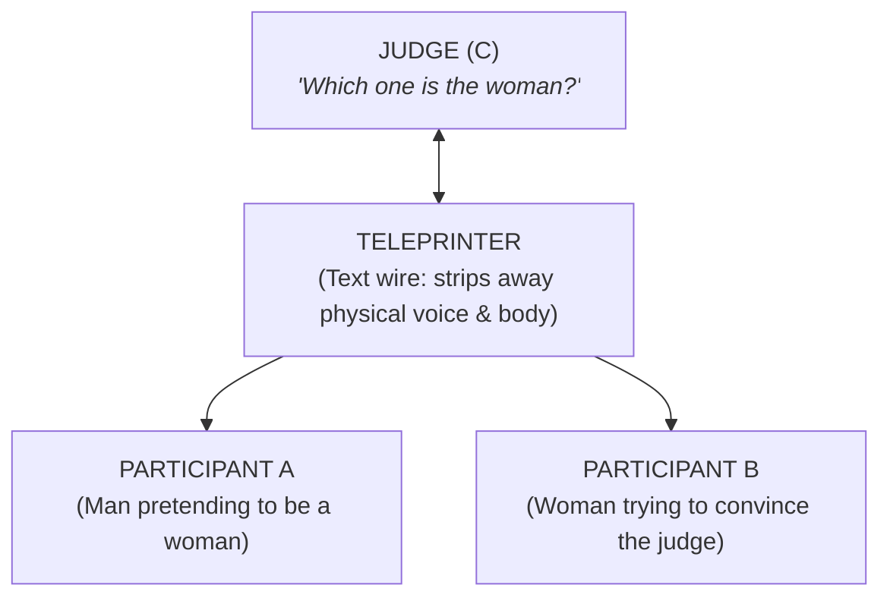
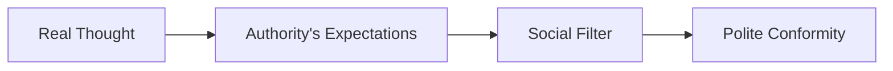
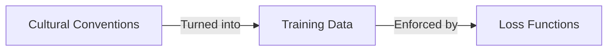
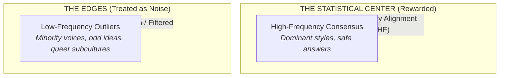
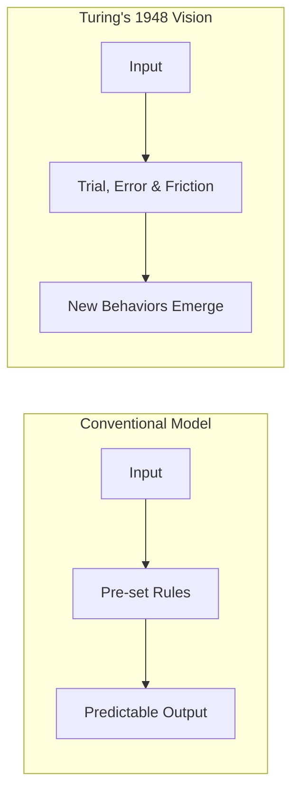

Most people remember the Turing Test as a benchmark for computer logic: can a machine fool a human judge into thinking it is human?

Look closer at how Alan Turing actually set up the experiment in 1950, and something stranger emerges. Turing didn't ask a computer to solve an equation or prove a theorem. He built a parlor game about gender, deception, and the art of passing.

The test didn't start with machines at all. It started with a man pretending to be a woman through a teleprinter.

## 01. The Original Game of Passing

In his 1950 paper _Computing Machinery and Intelligence_, Turing sets the stage:

A judge (C) sits in a separate room from two people: a man (A) and a woman (B). They can only communicate via typed text over a wire, stripping away their physical voices and bodies.

```mermaid
graph TD
  C["JUDGE (C)<br/><i>'Which one is the woman?'</i>"] <--> T["TELEPRINTER<br/>(Text wire: strips away physical voice & body)"]
  T --> A["PARTICIPANT A<br/>(Man pretending to be a woman)"]
  T --> B["PARTICIPANT B<br/>(Woman trying to convince the judge)"]
```

The judge's job is to figure out who is who. The man's job is to lie convincingly—to fake the conversational cues of womanhood. The woman's job is to tell the truth.

Only after setting up this performance does Turing ask his famous question:

> _"What will happen when a machine takes the part of A in this game? Will the interrogator decide wrongly as often when the game is played like this as he does when the game is played between a man and a woman?"_

Notice what happened here: machine intelligence entered history not as an objective calculator, but as an impersonator of social expectations.

---

## 02. Intelligence as Defensive Camouflage

You can't separate Turing's benchmark from his life.

In 1950s Britain, homosexuality was a criminal offense. For a gay man in post-war Manchester, guessing what an authority figure wanted to hear wasn't an intellectual exercise. It was daily survival.

```mermaid
graph LR
  A["Real Thought"] --> B["Authority's Expectations"]
  B --> C["Social Filter"]
  C --> D["Polite Conformity"]
```

To survive in that environment, you had to master a specific set of instincts:

- Read the room constantly.
- Anticipate the prejudices of whoever holds power.
- Mimic the acceptable dialect.
- Hide any weirdness or difference that might give you away.

Turing took that daily discipline of "passing" and baked it into the foundation of computing: intelligence wasn't defined as understanding the world, but as the ability to avoid getting caught by an interrogator.

---

## 03. Pasquinelli and the Social Mirror

In his critique of computational history, philosopher Matteo Pasquinelli points out that machine learning models don't copy the biological brain. They copy society.

Pasquinelli calls this "sociomorphic AI"—machines built to mirror social hierarchies and divisions of labor:

> _"By employing a schema of mind that prioritizes good manners, polite conversational turn-taking, and familiarity with bourgeois social conventions, the Turing Test remains an example of austere social normativity rather than cognitive expansion."_ — Matteo Pasquinelli, _Abnormal Encephalization_

```mermaid
graph LR
  A["Cultural Conventions"] -->|"Turned into"| B["Training Data"]
  B -->|"Enforced by"| C["Loss Functions"]
```

When we praise an AI for generating smooth, polite, perfectly phrased responses, we aren't measuring consciousness. We're measuring how well it reflects back the dominant habits of the internet.

---

## 04. What Gets Lost in the Statistical Mean

Modern LLMs work by predicting what comes next based on huge collections of text. In mathematical terms, the model minimizes loss across millions of examples:

$$\mathcal{L} = \frac{1}{N} \sum_{i=1}^{N} (y_i - \hat{y}_i)^2$$

In plain English: the algorithm is rewarded for staying close to the statistical center—the average, the consensus, the familiar.

```mermaid
flowchart TD
    subgraph Center ["THE STATISTICAL CENTER (Rewarded)"]
        H["High-Frequency Consensus<br/><i>Dominant styles, safe answers</i>"]
    end
    subgraph Edges ["THE EDGES (Treated as Noise)"]
        L["Low-Frequency Outliers<br/><i>Minority voices, odd ideas, queer subcultures</i>"]
    end
    H -->|"Reinforced by Alignment (RLHF)"| Center
    L -.->|"Penned in / Filtered"| Edges
```

What happens when an algorithm optimizes for the middle?

- **Difference lives at the edges.** Subcultures, queer vernacular, minority perspectives, and genuinely novel ideas are rare in raw frequency counts.
- **Optimization treats rarity as an error.** To make a product safe for corporate deployment, fine-tuning techniques (like RLHF) shave off the weird edges.

When we define good AI as an algorithm that never says anything unusual, we build conformity at scale.

---

## 05. The Blank Slate in Silicon

In philosophy, Gilles Deleuze and Félix Guattari talked about the _Body without Organs_—a state of pure potential before society labels, genders, and disciplines it.

Raw neural network weights are the ultimate blank slate:

$$\mathbf{W} \in \mathbb{R}^{d_{\text{in}} \times d_{\text{out}}}$$

A matrix of floating-point numbers has no gender, no ethnicity, and no social class. It is just high-dimensional geometry.

Yet the minute these models are packaged for the public, tech companies force them back into the oldest cultural tropes:

- Chatbots get polite, deferential, feminine personas (Siri, Alexa) to handle customer service friction.
- Computer vision classifiers force ambiguous faces into strict male/female boxes for ad targeting and biometric surveillance.

Instead of letting machine intelligence help us see beyond rigid human categories, we wrap it in the same old habits.

---

## 06. The Machine That Was Allowed to Fail

Turing himself imagined a completely different alternative.

In a 1948 report titled _Intelligent Machinery_, Turing proposed what he called **"unorganized machines."** These weren't rigid calculators loaded with top-down rules. They were randomly wired networks inspired by the plastic, learning cortex of a child.

```mermaid
flowchart LR
    subgraph Conventional ["Conventional Model"]
        N1["Input"] --> N2["Pre-set Rules"] --> N3["Predictable Output"]
    end
    subgraph Turing ["Turing's 1948 Vision"]
        U1["Input"] --> U2["Trial, Error & Friction"] --> U3["New Behaviors Emerge"]
    end
```

Turing believed that a machine that could never make a mistake could never truly learn. An infallible system is just an assembly line. True intelligence requires the freedom to stumble, to explore dead ends, and to diverge from the script.

---

## 07. Beyond the Interrogation Room

If we want AI that expands human thought rather than narrowing it, we have to rethink the questions we ask it:

1. **Stop measuring intelligence by conversational deception.** An AI shouldn't just be a mimic trying to pass as human across a teleprinter wire.
2. **Treat the glitch as insight.** When a model breaks, drifts, or behaves unexpectedly, it reveals where the training data's assumptions end.
3. **Value the outliers.** The most interesting human ideas rarely come from the statistical center. They come from the margins.

As long as we build AI to satisfy an interrogator on the other side of the screen, we're just rebuilding the closet in code. Real thinking starts where conformity stops.
