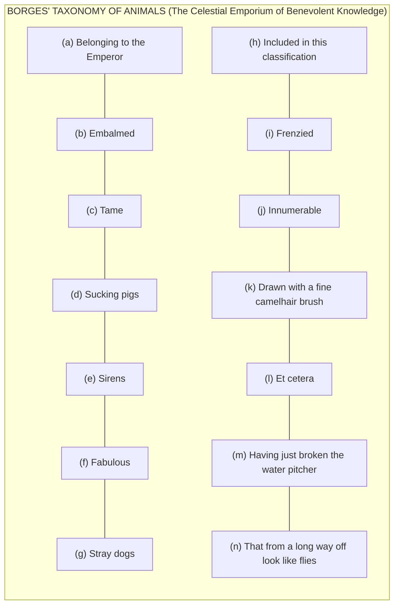
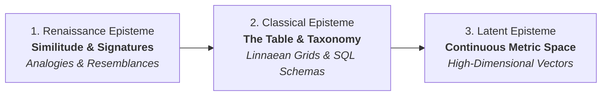
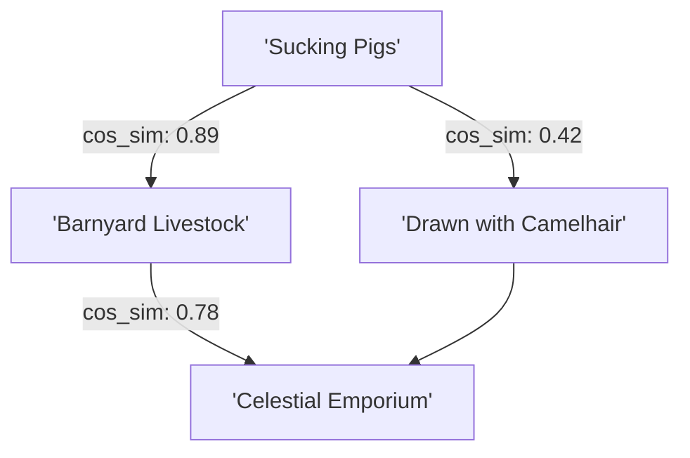

## 01. The Laughter of Borges and the Spatial Grid

In the preface to _The Order of Things_ (1966), Michel Foucault admitted his book started with laughter. He had been reading a short essay by Jorge Luis Borges about an imaginary Chinese encyclopedia called _The Celestial Emporium of Benevolent Knowledge_. In it, animals are divided into categories that refuse to make ordinary sense:

The joke works because the list refuses to settle into any kind of common ground. Sirens and embalmed dogs are easy enough to picture on their own. What feels impossible is picturing a single room or table where all fourteen of these things make sense sitting side by side.

Foucault used this absurdity to introduce what he called the **episteme**: the unspoken grid every culture uses to decide what belongs together, what can be compared, and what counts as a sensible thought.

To see how modern AI organizes knowledge, look past the chat window. The mathematical coordinate maps behind these systems—vector spaces and embeddings—are the digital version of Foucault's grid.

---

## 02. Three Epochs of the Grid: From Resemblance to Coordinates

Foucault traced three major ways Western culture organized knowledge over time. Look at them through the history of computing, and you get a clear view of how software learned to store reality:

1. **The Renaissance (Resemblance)**: Knowledge worked through visual clues and analogies. A walnut looked like a brain, so doctors prescribed it for headaches. Everything in the world was treated as a sign pointing to something else.
2. **The Classical Era (The Table)**: Think of early botanists like Carl Linnaeus sorting living things into rigid kingdoms, classes, and species. Everything got its own box, row, and column. In software engineering, this gave us the **Relational Database (SQL)**: strict tables, clean categories, and clear rules. An entry fits the schema or the system rejects it.
3. **The AI Era (Coordinates on a Map)**: Modern AI models do not file ideas into separate drawers. Instead, they convert words, images, and audio into coordinates on a vast digital map with hundreds or thousands of dimensions.

---

## 03. Distance as Meaning

In a vector database, organizing ideas is no longer a matter of yes-or-no categories. Two concepts are not separated by different folders or tags. They are separated by physical distance on a coordinate map, often calculated with a metric called **Cosine Similarity**:

$$\text{Similarity}(\mathbf{A}, \mathbf{B}) = \frac{\mathbf{A} \cdot \mathbf{B}}{\|\mathbf{A}\|_2 \|\mathbf{B}\|_2}$$

Instead of checking whether two things share a category label, the system measures the angle between them:

- "The Emperor" and "Fine camelhair brush" end up close together because they frequently appear in similar contexts in the training text.
- "Frenzied" and "Sucking pig in a storm" share neighborhood coordinates because the model learned how those words cluster across millions of pages.

Meaning is no longer defined by an entry in a dictionary. It is defined by neighborhood.

---

## 04. Traditional Databases vs. AI Coordinate Spaces

Trading rigid tables for spatial maps changes what a computer system considers true or relevant:

| Dimension              | Traditional Databases (SQL)             | AI Vector Spaces                                   |
| :--------------------- | :-------------------------------------- | :------------------------------------------------- |
| **Structure**          | Top-down, strict rules, tidy rows       | Learned clusters, fluid coordinates                |
| **Boundaries**         | Hard cutoffs (`WHERE type = 'animal'`)  | Gradients and closeness ($\text{distance} < 0.25$) |
| **Flexibility**        | Rejects unexpected or misspelled inputs | Understands metaphors, typos, and synonyms         |
| **When it fails**      | Returns an error or an empty result     | Hallucinates or drifts into strange associations   |
| **Who sets the rules** | A software engineer writing the schema  | The training data and the model weights            |

Every time an AI retrieves background information to answer a question, it answers Foucault's original dilemma:

> _"On what table do these fragments of human thought sit together?"_

---

## 05. A Practical Reality Check: Beyond Static Maps

This spatial metaphor helps us visualize how machines work, but modern language models are more complicated than a flat map.

In a simple retrieval setup, a word or paragraph gets converted into fixed coordinates—like pinning notes to specific spots on a bulletin board. But inside a large language model with dozens of layers, words do not stay pinned in place:

1. **Context reshapes meaning**: The coordinates of a word shift depending on what surrounds it. "Apple" lands in one region when talking about orchards, and in another when discussing consumer tech.
2. **Layered circuits**: The model uses layers of attention heads and internal pathways that blend, amplify, or suppress different nuances as it reads through a sentence.
3. **Dynamic thought paths**: Generating an answer is a moving path through the network, not a simple lookup in a frozen index.

Thinking of knowledge as a coordinate space is a helpful picture: it shows how computing shifted away from rigid filing cabinets toward fluid landscapes. But the models themselves are always shifting the ground underneath those coordinates.

---

## 06. The Politics of the Coordinate System

Even with that complexity, the fundamental shift remains: we traded human-designed filing systems for machine-learned geometric maps.

Whoever collects the training data and configures the retrieval pipeline shapes that map:

Curating datasets and training models is more than benchmarking performance. It determines which ideas are allowed to sit together, which nuances get flattened out, and which connections are made easy or impossible to find.

Writing that code is engineering, but the result is philosophical: it decides how our tools organize the order of things.
