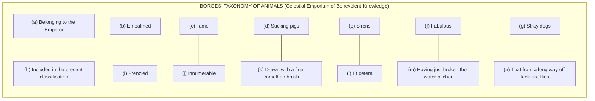
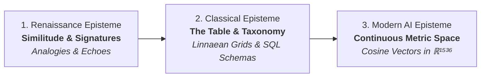
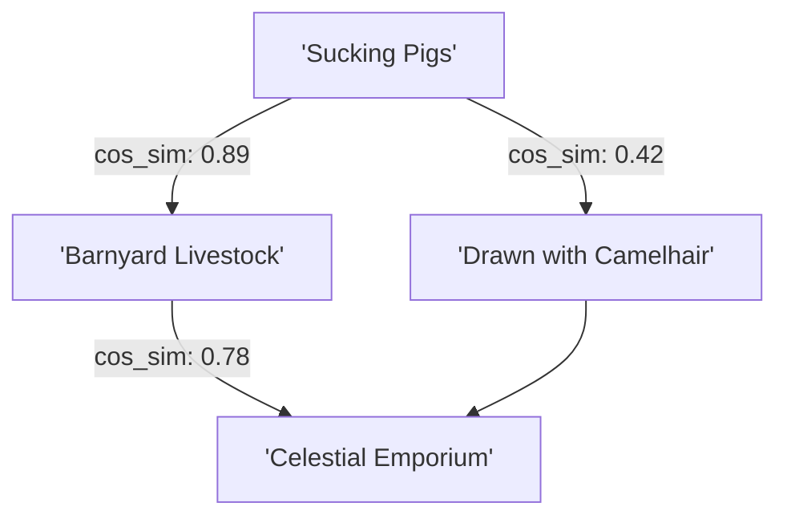

## 01. The Laughter of Borges and the Spatial Grid

In the famous preface to _The Order of Things_ (_Les Mots et les Choses_, 1966), Michel Foucault confesses that his book was born out of a text by Jorge Luis Borges—specifically, from the laughter that shattered all the familiar landmarks of his thought.

Borges cites a fictional Chinese encyclopedia entitled _The Celestial Emporium of Benevolent Knowledge_, in which animals are divided into the following categories:

To modern eyes, this taxonomy is hilarious not because sirens or embalmed animals are fictional, but because the **system of coordinates** that allows them to juxtapose alongside one another feels impossible.

Foucault used this absurdity to introduce his central philosophical concept: the **episteme** (_épistémè_). What is the invisible table (_la grille_), the implicit spatial ground upon which a given culture orders its concepts, establishes resemblance, and decides what is true?

Fast forward to contemporary artificial intelligence: **Vector databases and high-dimensional embedding spaces are the digital manifestation of Foucault’s episteme.**

---

## 02. The Historical Grids: From Renaissance Similitude to Continuous Manifolds

Foucault traced three major epistemes in Western thought. When mapped onto the history of computation, we discover a direct lineage leading to vector embeddings:

1. **The Renaissance Episteme (Resemblance)**: Knowledge was read through signatures, sympathies, and analogies. An herb that looked like an eye was believed to cure vision.
2. **The Classical Episteme (The Table & Taxonomy)**: Knowledge was organized into rigid, discrete grids (like Linnaean biology or the periodic table). In computing, this became **Relational SQL Databases**: strict schemas, tables, primary keys, and foreign keys.
3. **The AI Episteme (Continuous Metric Topologies)**: Today, high-dimensional neural networks do not store concepts in rigid tables. They map sentences, concepts, images, and audio into continuous geometric manifolds (e.g., $\mathbb{R}^{1536}$ in OpenAI's `text-embedding-3-small`).

---

## 03. High-Dimensional Proximity as Truth

In vector space, classification is not binary. Two concepts are not separated by a foreign key or a discrete folder—they are separated by **Cosine Distance**:

$$\text{Similarity}(\mathbf{A}, \mathbf{B}) = \frac{\mathbf{A} \cdot \mathbf{B}}{\|\mathbf{A}\|_2 \|\mathbf{B}\|_2}$$

In a 1536-dimensional space:
- "The Emperor" and "Fine camelhair brush" can occupy adjacent geometric clusters if their training context correlates.
- Words with no lexical overlap ("frenzied" and "sucking pig in a storm") become neighbors based on latent context vectors.

---

## 04. Relational SQL vs. Vector Space Epistemology

The transition from traditional databases to vector storage represents a radical epistemological shift:

| Dimension | Classical SQL Episteme | Vector Latent Episteme |
| :--- | :--- | :--- |
| **Logic** | Top-down, discrete, rule-based | Emergent, continuous, probabilistic |
| **Boundaries** | Hard binary edges (`WHERE category = 'animal'`) | Soft topological contours ($\text{distance} < 0.25$) |
| **Flexibility** | Brittle to out-of-schema queries | Fluid across metaphors, dialects, and synonyms |
| **Failure Mode** | Returns `NULL` or syntax error | Hallucination or semantic drift into strange neighborhoods |
| **Governance** | Explicit database schema administrator | Implicit transformer training loss function |

When an autonomous AI agent executes a semantic search or retrieves context for an LLM prompt, it is constantly posing Foucault's question:

> _"Under what spatial order do these disparate pieces of human culture belong together?"_

---

## 05. The Epistemological Power of the Vector Architect

Whoever controls the architecture of the embedding model and the indexing strategy of the vector database controls the lens through which machines perceive reality.

When enterprise teams fine-tune embeddings or partition vector clusters, they are not just tuning database latencies:

- They are deciding which ideas are permitted to be "neighbors".
- They are defining which nuances are compressed away as noise.
- They are building the modern _grille_ upon which synthetic intelligence will synthesize knowledge for the next century.

To build a vector database is not merely to optimize retrieval; **it is an epistemological act of defining the order of things.**
