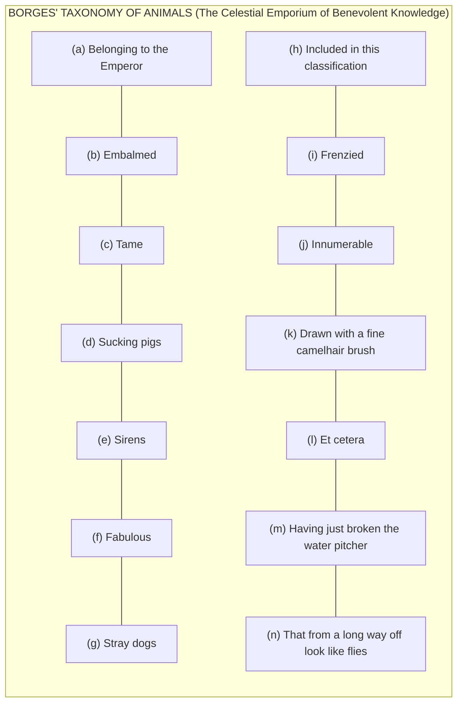
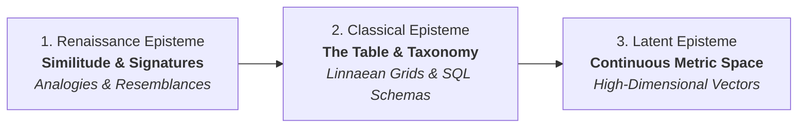
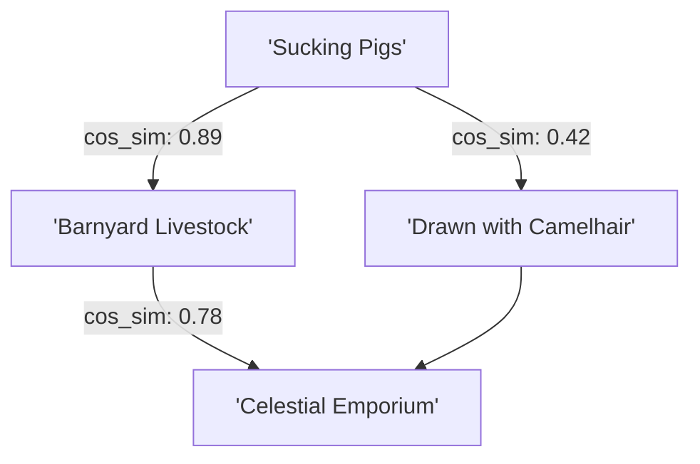

## 01. The Laughter of Borges and the Spatial Grid

In the preface to *The Order of Things* (1966), Michel Foucault admits his book began with laughter. He had been reading a short piece by Jorge Luis Borges about a fictional Chinese encyclopedia called *The Celestial Emporium of Benevolent Knowledge*. In it, animals are divided into categories that refuse to make ordinary sense:

```mermaid
flowchart TD
    subgraph Emporium ["BORGES' TAXONOMY OF ANIMALS (The Celestial Emporium of Benevolent Knowledge)"]
        direction TB
        A["(a) Belonging to the Emperor"] --- B["(b) Embalmed"] --- C["(c) Tame"] --- D["(d) Sucking pigs"] --- E["(e) Sirens"] --- F["(f) Fabulous"] --- G["(g) Stray dogs"]
        H["(h) Included in this classification"] --- I["(i) Frenzied"] --- J["(j) Innumerable"] --- K["(k) Drawn with a fine camelhair brush"] --- L["(l) Et cetera"] --- M["(m) Having just broken the water pitcher"] --- N["(n) That from a long way off look like flies"]
    end
```

The joke works because the list feels impossible to hold in your head. It is not that sirens or embalmed dogs do not exist. It is that we cannot imagine the tabletop where all fourteen of these things could sit side by side.

Foucault used that disorientation to introduce his central idea: the **episteme** (*épistémè*). Every culture operates on an unspoken, invisible grid. It is the underlying spatial arrangement that determines what can be compared, what belongs together, and what counts as coherent thought.

If you want to understand how modern AI organizes knowledge, look past the chat interface. High-dimensional vector embeddings and latent spaces are the modern digital equivalent of Foucault's grid.

---

## 02. Three Epochs of the Grid: From Similitude to Latent Geometry

Foucault traced three major epistemes across Western history. Map them onto computer science, and you get a clear history of how machines have stored reality:

```mermaid
flowchart LR
    E1["1. Renaissance Episteme<br/><b>Similitude & Signatures</b><br/><i>Analogies & Resemblances</i>"] --> E2["2. Classical Episteme<br/><b>The Table & Taxonomy</b><br/><i>Linnaean Grids & SQL Schemas</i>"] --> E3["3. Latent Episteme<br/><b>Continuous Metric Space</b><br/><i>High-Dimensional Vectors</i>"]
```

1. **The Renaissance Episteme (Resemblance)**: Knowledge worked through analogies and echoes. Walnut shells looked like skulls, so physicians prescribed them for headaches. The world was a book of signs waiting to be deciphered.
2. **The Classical Episteme (The Table)**: Think Linnaeus sorting plants into neat kingdoms, classes, and orders. Everything got a row, a column, and a boundary. In software engineering, this gave us the **Relational SQL Database**: strict schemas, fixed tables, primary keys, and foreign keys. An entity is either in the table or it violates the constraint.
3. **The Latent Episteme (Continuous Metric Topologies)**: Modern models do not file concepts into separate drawers. Instead, they project text, images, and audio into continuous geometric coordinates (like $\mathbb{R}^{1536}$ in standard embedding models).

---

## 03. Distance as Meaning

In a vector index, classification is no longer binary. Two ideas are not separated by an arbitrary folder path or an SQL `JOIN` clause. They are separated by geometric distance, usually measured by **Cosine Similarity**:

$$\text{Similarity}(\mathbf{A}, \mathbf{B}) = \frac{\mathbf{A} \cdot \mathbf{B}}{\|\mathbf{A}\|_2 \|\mathbf{B}\|_2}$$

In a 1,536-dimensional coordinate space:

- "The Emperor" and "Fine camelhair brush" drift into neighboring positions if their training contexts frequently intersect.
- "Frenzied" and "Sucking pig in a storm" share proximity because the model learned their semantic contours across millions of training passages.

```mermaid
flowchart TD
    SP["'Sucking Pigs'"] -->|"cos_sim: 0.89"| BL["'Barnyard Livestock'"]
    SP -->|"cos_sim: 0.42"| DC["'Drawn with Camelhair'"]
    BL -->|"cos_sim: 0.78"| CE["'Celestial Emporium'"]
    DC --> CE
```

Meaning is no longer defined by an explicit definition in a dictionary. It is defined by neighborhood.

---

## 04. Relational SQL vs. Vector Latent Epistemology

Moving from relational tables to latent representations is not just an optimization choice. It changes what the system considers "true":

| Dimension | Classical SQL Episteme | Vector Latent Episteme |
| :--- | :--- | :--- |
| **Structure** | Top-down, discrete, rule-based | Emergent, continuous, probabilistic |
| **Boundaries** | Hard binary edges (`WHERE type = 'animal'`) | Soft contours ($\text{distance} < 0.25$) |
| **Flexibility** | Breaks on out-of-schema entries | Handles metaphors, typos, and synonyms |
| **Failure Mode** | Returns `NULL` or a syntax error | Hallucinates or drifts into strange semantic valleys |
| **Authority** | The database administrator's schema | The weights of the embedding model |

When an AI retrieval system pulls context for a prompt, it answers Foucault's original question:

> *"Under what spatial order do these fragments of human thought belong together?"*

---

## 05. A Necessary Reality Check: Beyond Static Embeddings

Before taking this metaphor too far, we need a dose of engineering reality.

Static vector embeddings—like those used in basic RAG pipelines or vector databases—are a clean thought experiment. They give us an intuitive way to picture how machines turn language into geometry. But modern Large Language Models have moved well past static spatial lookups.

An LLM is not just a giant vector database.

When a 70-billion-parameter transformer processes a prompt, tokens do not stay frozen at fixed coordinates:

1. **Context-Dependent Activations**: The representation of a word changes radically across dozens of attention layers based on everything around it.
2. **Dynamic Circuits**: Mechanism-level interpretability shows that transformers rely on complex internal circuits—induction heads, superposition across polysemantic neurons, and feature dictionaries—rather than a single flat Euclidean map.
3. **Multi-Step Reasoning**: Generation is a dynamic trajectory through activation space, not a static nearest-neighbor retrieval.

Thinking of knowledge as a geometric vector space is an analogy—a helpful lens for seeing how we abandoned discrete symbolic tables in favor of continuous high-dimensional spaces. But real model behavior is far messier and more dynamic than any single frozen index.

---

## 06. The Politics of the Coordinate System

Even with that complexity in mind, the foundational premise holds: we have traded human-curated taxonomies for machine-learned geometric topologies.

Whoever trains the model and designs the retrieval pipeline decides the geometry of that space:

```mermaid
flowchart LR
    W["TRAINING DATA & LOSS FUNCTION"] -->|"shapes"| D["LATENT GEOMETRY"] -->|"constrains"| R["RETRIEVED CONTEXT"] -->|"guides"| G["SYNTHESIZED OUTPUT"]
```

When teams curate datasets, filter tokens, or fine-tune embedding layers, they are not only improving retrieval benchmarks. They are deciding which ideas are allowed to be neighbors, which concepts get flattened into noise, and which associations become impossible.

Building these systems is technical work. But at its core, it remains an epistemological act: deciding how our tools will carve up the order of things.
