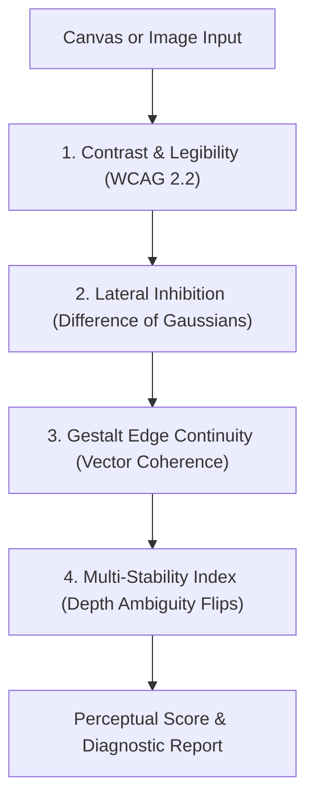

## What is Perceptual Vision Eval?

Standard computer vision algorithms usually rely on structural comparison metrics like SSIM or mathematical similarity models like CLIP. While those metrics work well for image compression or search indexing, they don't predict how a human eye and brain actually experience a visual asset.

Think of **Perceptual Vision Eval** as an **eye doctor for computer graphics and web UIs**.

It is an open-source JavaScript and Node.js toolkit built on visual psychophysics. It reads image pixel data or HTML5 `<canvas>` elements, runs them through models of human retinal and cognitive vision, and returns an automated perceptual health score out of 100.

---

## The 4 Core Visual Diagnostics



### 1. Contrast & Text Legibility

- **What it does:** Measures luminance contrast ratios across text, buttons, and background surfaces using WCAG 2.2 guidelines and relative luminance equations.
- **Why it matters:** Ensures dark mode interfaces and dithered graphic backgrounds stay easy to read without causing viewer eye strain.

### 2. Glare & Eye Strain (Lateral Inhibition)

- **What it does:** Simulates how human retinal ganglion cells process brightness boundaries using a Difference of Gaussians (DoG) filter kernel:

  $$K_{\text{DoG}} = G_{\sigma_1} - G_{\sigma_2}$$

- **Why it matters:** Flags harsh step transitions that create Mach bands (phantom glow lines along edges), visual glare, and viewer fatigue.

### 3. Shape & Border Continuity (Gestalt Coherence)

- **What it does:** Applies Sobel gradient filters to calculate orientation vector coherence across edges, measuring figure-ground separation.
- **Why it matters:** Checks whether objects and boundaries group together naturally into clear visual structures or dissolve into noisy, chaotic shapes.

### 4. Optical Illusions & Ambiguity (Multi-Stability)

- **What it does:** Analyzes spatial frequency phase shifts to identify ambiguous regions where the human brain oscillates between conflicting 3D depth interpretations (such as a Necker cube illusion).
- **Why it matters:** Catches synthetic AI images or graphics that look visually unstable or optically disorienting.

---

## Quickstart & Installation

You can install the toolkit via `npm` or clone the repository directly:

```bash
# Clone the repository
git clone https://github.com/untitled-jpg/perceptual-vision-eval.git

# Navigate to directory and install dependencies
cd perceptual-vision-eval
npm install

# Run test suite
npm test

# Launch local interactive demo
npm run demo
```

---

## Usage & API Reference

The library exports a `PerceptualEvaluator` class alongside standalone metric functions. It accepts an `HTMLCanvasElement`, `CanvasRenderingContext2D`, `ImageData`, or a raw pixel object `{ data, width, height }`.

```javascript
import { PerceptualEvaluator } from "perceptual-vision-eval";

// Select target canvas element
const canvas = document.getElementById("viewport");
const ctx = canvas.getContext("2d");

// Initialize evaluator with custom sensitivity settings
const evaluator = new PerceptualEvaluator({
  luminanceFormula: "WCAG21", // 'WCAG21' | 'RelativeLuminance'
  lateralInhibitionSigma: 1.8, // Receptive field kernel size
  gestaltThreshold: 0.42, // Edge grouping sensitivity
  multiStabilitySensitivity: 0.75, // Depth ambiguity sensitivity
});

// Run automated perceptual analysis
const report = evaluator.analyze(canvas);

console.log(`Perceptual Score: ${report.score} / 100`);
console.log(`Contrast Ratio: ${report.metrics.contrastRatio}:1`);
console.log(`Mach Banding Warning: ${report.diagnostics.machBandingWarning}`);
console.log(`Depth Ambiguity: ${report.diagnostics.hasDepthAmbiguity}`);
console.log(`Diagnostic Summary: ${report.diagnostics.summary}`);
```

---

## Technical Specifications & Diagnostic Thresholds

| Metric Parameter                                   | Target Range / Threshold          | Perceptual Diagnostic Goal                            |
| :------------------------------------------------- | :-------------------------------- | :---------------------------------------------------- |
| **Luminance Contrast ($L_r$)**                     | $\ge 4.5:1$ (AA), $\ge 7:1$ (AAA) | Verifies text legibility on dark or dithered surfaces |
| **Lateral Inhibition ($\mathbf{K}_{\text{DoG}}$)** | Peak ratio $\le 2.4$              | Prevents Mach band glare lines and visual fatigue     |
| **Gestalt Continuity ($C_g$)**                     | Score $\in [0.65, 0.95]$          | Confirms clear figure-ground boundary separation      |
| **Multi-Stability Index ($M_s$)**                  | Index $\le 0.30$                  | Flags ambiguous 3D depth flips in synthetic media     |

---

## Interactive Demo

The project includes an interactive HTML5 Canvas demo. Run `npm run demo` and open `http://localhost:3000` to test sample patterns (Mach bands, UI text contrast grids, Gestalt shapes, and multi-stable figures) with live visual heatmaps.
