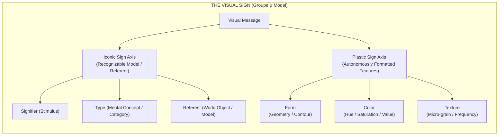

## 01. The Impasse of Linguistic Imperialism

For decades, the study of visual images was hobbled by what **Groupe µ** (the Liege school of semiotics led by Francis Élineau, Jean-Marie Klinkenberg, and colleagues) identified as **linguistic imperialism**. Semioticians repeatedly attempted to force visual communication into rigid linguistic molds—treating brushstrokes or pixels as "phonemes" and pictorial scenes as linear "syntax."

This metaphoric transfer produced confusion. Words operate through arbitrary, unmotivated conventions; images, by contrast, engage directly with the neurophysiology of human perception. In their landmark work _Traité du signe visuel_ (1992), Groupe µ proposed a rigorous, autonomous foundation for visual semiotics built on a crucial bifurcation: **the separation between the Iconic Sign and the Plastic Sign**.



Today, this division has profound implications for generative artificial intelligence. Latent diffusion models (Stable Diffusion, Midjourney, FLUX) and vision-language architectures are routinely lauded as "understanding" visual scenes. However, a rigorous semiotic audit reveals the opposite: **Generative AI is a master of plastic rhetoric while remaining structurally blind to iconic referents.**

---

## 02. The Triadic Iconic Model vs. Plastic Autonomy

To understand why synthetic image generators produce convincing photorealism alongside absurd physical impossibilities (six-fingered hands, floating chair legs, non-Euclidean shadows), we must examine Groupe µ’s triadic formulation of iconic sign recognition.

Unlike Charles Sanders Peirce’s classical triad (Sign, Object, Interpretant), Groupe µ formulates the iconic sign as a transformation across three distinct poles:

1. **Signifier ($SS$):** The concrete spatial stimulus rendered on canvas, paper, or screen.
2. **Referent ($RR$):** The real or imaginary object in the physical world.
3. **Type ($TT$):** The abstract mental category or structural schema stored in biological memory that mediates between $SS$ and $RR$.

$$\text{Iconicity}(\mathbf{SS}, \mathbf{RR}) = f_{\text{transformation}}(\mathbf{SS} \to \mathbf{TT}) \cdot \delta(\mathbf{TT}, \mathbf{RR})$$

An image of a cat is not an iconic sign because it physically resembles a real cat ($RR$); it is an iconic sign because the spatial arrangement of its signifier ($SS$) conforms to the perceptual **Type** ($TT$) of "catness" encoded in human visual cognition.

### The Autonomy of the Plastic Sign

Crucially, Groupe µ demonstrated that an image contains a parallel, autonomous layer of signification: the **Plastic Sign**. Plastic signs do not depend on type recognition or real-world referents. They consist of three fundamental spatial parameters:

| Plastic Dimension | Physical / Computational Correlate              | Perceptual Function                                    |
| :---------------- | :---------------------------------------------- | :----------------------------------------------------- |
| **Form**          | Geometric spatial coordinates & contours        | Spatial enclosure, orientation, and Gestalt grouping   |
| **Color**         | Spectral frequency, luminance, and chromaticity | Emotional mood, figure-ground separation, and contrast |
| **Texture**       | Spatial frequency distributions and micro-grain | Tactile suggestion, surface quality, and density       |

While an iconic sign asks: _"What does this depict?"_, a plastic sign asks: _"How does this spatial organization affect perception?"_ Cezanne’s parallel brushstrokes, Mondrian’s primary grids, or a dithered high-contrast texture act directly upon the human visual cortex before any object identification takes place.

---

## 03. Isotopy, Alotopy, and the Mechanics of Visual Rhetoric

In Groupe µ's framework, **visual rhetoric** is defined as a regulated transformation that introduces a controlled deviation (**alotopy**) from an established norm or baseline (**isotopy**).

> _"Rhetoric is not mere ornamentation; it is the deliberate operation of deviation (alotopy) from a spatial norm (grado zero), forcing the recipient to re-evaluate the visual message."_ — Groupe µ, _Traité du signe visuel_

Visual rhetoric operates across four fundamental transformations:

```text
RHETORICAL OPERATIONS MATRIX:
1. SUPPRESSION   ──(Removal)──────> Silhouette, vignette, cropped frame
2. ADJUNCTION    ──(Addition)─────> Overlarge borders, graphic overlays
3. SUBSTITUTION  ──(Replacement)──> Arcimboldo composite heads, visual puns
4. PERMUTATION   ──(Rearrangement)─> Reversible figures, spatial inversions
```

When an artwork presents a figure that violates expected spatial continuity—such as René Magritte’s _Le Viol_ (where a female torso substitutes for a face)—it creates an **alotopy**. The viewer’s cognitive system detects the conflict between plastic continuity (the outline of a head) and iconic substitution (breasts replacing eyes), triggering an active interpretative loop.

---

## 04. Generative AI as Latent Plastic Rhetoric

Why is this theoretical distinction vital for understanding modern AI image synthesis?

When a latent diffusion model is trained on billions of image-text pairs, it does **not** construct iconic types ($TT$) or model real-world physical referents ($RR$). Instead, it maps high-dimensional statistical correlations across plastic parameters in latent vector space:

$$\mathbf{z}_{\text{latent}} = \text{Encoder}(\text{Image}) \in \mathbb{R}^{d}$$

$$\text{Similarity}(\mathbf{z}_1, \mathbf{z}_2) = \frac{\mathbf{z}_1 \cdot \mathbf{z}_2}{\|\mathbf{z}_1\|_2 \|\mathbf{z}_2\|_2}$$

The model learns that certain text tokens ("cinematic lighting," "8k resolution," "dithered texture") correlate with specific high-frequency spatial gradients, color palettes, and plastic edge distributions.

```text
COMPUTATIONAL FLOW IN GENERATIVE PIPELINES:
[PROMPT TOKENS] ──(Text Encoder)──> [LATENT VECTOR z] ──(UNet / DiT Denoising)──> [PLASTIC MANIFOLD]
                                                                                      │
                                                                       (Lacks Iconic Physical Grounding)
                                                                                      ▼
                                                                        [SYNTHETIC RHETORICAL ALOTOPY]
```

Consequently:

- **Diffusion models produce flawless plastic isotopy:** The specular highlights, sub-surface scattering, volumetric fog, and micro-textures are mathematically harmonious because they are sampled from continuous gaussian latent distributions.
- **Diffusion models frequently fail at iconic isotopy:** Because the neural network has no internal model of 3D anatomical kinetics or causal spatial mechanics, it renders hands with extra digits or legs that merge seamlessly into table legs.

To the human viewer, the image appears breathtaking at first glance because its **plastic signs** trigger instant aesthetic resonance in the visual cortex. Only upon secondary scrutiny does the cognitive system realize that the **iconic signs** represent impossible physical absurdities.

---

## 05. The Reborde: Indexical Framing in Synthetic Interfaces

Groupe µ devoted extensive study to the **reborde** (the frame or border). The frame is an indexical sign that delineates an enunciated visual space from its surrounding environment.

In digital interfaces and AI generation tools, the frame is no longer passive. It acts as an active semiotic filter:

1. **Desbordamiento (Overflow):** Generative outpainting forces the visual algorithm to extend plastic textures beyond the initial frame, guessing context through local spatial redundancy.
2. **Iconicization of the Frame:** Prompt boxes, bounding boxes, and seed parameters become part of the image’s visual rhetoric, exposing the computational apparatus behind the canvas.

```text
+-------------------------------------------------------------------+
| INDEXICAL FRAME (REBORDE)                                         |
|  +-------------------------------------------------------------+  |
|  | ENUNCIATED PLASTIC SPACE                                     |  |
|  |  - Form: High-frequency dithered grid                       |  |
|  |  - Color: Midnight Slate (#1B2427) & Coral Red (#E84A5F)   |  |
|  |  - Alotopy: Iconic spatial rupture / Latent sampling        |  |
|  +-------------------------------------------------------------+  |
+-------------------------------------------------------------------+
```

---

## 06. Conclusion: Toward an Autonomous Plastic Criticism

By returning to Groupe µ’s _Traité du signe visuel_, we gain a critical vocabulary to critique synthetic culture without falling into naive panics about "fake images."

Synthetic representation is not merely an imitation of human vision; it is a hyper-developed **plastic rhetoric engine**. It manipulates color gradients, textural density, and spatial contours with unprecedented statistical precision while remaining fundamentally detached from physical referents.

As creators, researchers, and designers operating in the age of latent space representation, our task is to master both axes: utilizing plastic rhetoric to construct evocative visual spaces while maintaining critical awareness of the invisible computational frames that order our perception of reality.
