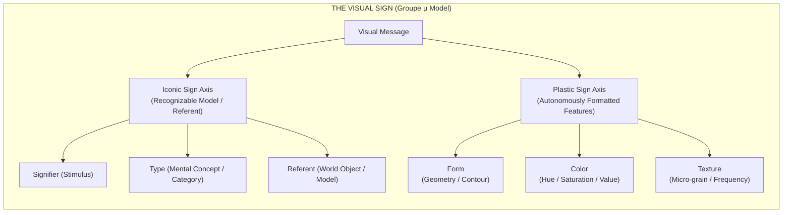

## 01. The Impasse of Linguistic Imperialism

For decades, visual theory was stuck in what **Groupe µ** (the Liège semiotics group led by Francis Élineau, Jean-Marie Klinkenberg, and their colleagues) called **linguistic imperialism**. Critics kept trying to force visual media into rigid language molds—treating pixels or brushstrokes like "phonemes" and entire pictures like sentence syntax.

That analogy broke down quickly. Words rely on arbitrary, agreed-upon rules. Images, by contrast, act directly on how our brains process visual input. In _Traité du signe visuel_ (1992), Groupe µ carved out a clean foundation for visual semiotics based on one clear division: **the Iconic Sign versus the Plastic Sign**.



This distinction cuts right to the heart of generative AI. Models like Stable Diffusion, Midjourney, or FLUX are often described as "understanding" what they draw. But a quick semiotic check shows the opposite: **Generative AI has mastered plastic style and surface texture, while remaining blind to real-world referents.**

---

## 02. The Triadic Iconic Model vs. Plastic Autonomy

To see why synthetic image generators produce stunning lighting alongside absurd physical mistakes—like six fingers on a hand or table legs merging into floors—it helps to look at how Groupe µ breaks down iconic recognition.

Unlike Charles Sanders Peirce’s standard triad (Sign, Object, Interpretant), Groupe µ frames the iconic sign as a relationship across three points:

1. **Signifier ($SS$):** The visual pattern rendered on screen, paper, or canvas.
2. **Referent ($RR$):** The actual object or concept in the physical world.
3. **Type ($TT$):** The mental category or schema in our memory that connects $SS$ to $RR$.

$$\text{Iconicity}(\mathbf{SS}, \mathbf{RR}) = f_{\text{transformation}}(\mathbf{SS} \to \mathbf{TT}) \cdot \delta(\mathbf{TT}, \mathbf{RR})$$

A picture of a cat isn't an iconic sign because it physically matches a real cat ($RR$). It's an iconic sign because the arrangement of lines and colors ($SS$) triggers the mental category of "cat" ($TT$) stored in human memory.

### The Autonomy of the Plastic Sign

Groupe µ showed that an image also works on a second, parallel level: the **Plastic Sign**. Plastic signs don't care about object recognition or real-world targets. They operate through three raw spatial qualities:

| Plastic Dimension | Physical / Computational Correlate              | Perceptual Function                          |
| :---------------- | :---------------------------------------------- | :------------------------------------------- |
| **Form**          | Geometric spatial coordinates & contours        | Enclosure, orientation, and Gestalt grouping |
| **Color**         | Spectral frequency, luminance, and chromaticity | Tone, figure-ground separation, and contrast |
| **Texture**       | Spatial frequency distributions and micro-grain | Surface feel, tactile density, and grain     |

An iconic sign asks, _"What is this depicting?"_ A plastic sign asks, _"How does this visual arrangement affect how I see?"_ Cézanne’s blocky brushstrokes, Mondrian’s black grid lines, or a noisy dithered gradient hit the visual cortex before we even register what objects are in the frame.

---

## 03. Isotopy, Alotopy, and the Mechanics of Visual Rhetoric

In Groupe µ's framework, **visual rhetoric** happens when an artwork introduces a deliberate break (**alotopy**) from an expected visual baseline (**isotopy**).

> _"Rhetoric is not mere ornamentation; it is the deliberate operation of deviation (alotopy) from a spatial norm (grado zero), forcing the recipient to re-evaluate the visual message."_ — Groupe µ, _Traité du signe visuel_

Visual rhetoric relies on four basic moves:

```text
RHETORICAL OPERATIONS MATRIX:
1. SUPPRESSION   ──(Removal)──────> Silhouette, vignette, cropped frame
2. ADJUNCTION    ──(Addition)─────> Overlarge borders, graphic overlays
3. SUBSTITUTION  ──(Replacement)──> Arcimboldo composite heads, visual puns
4. PERMUTATION   ──(Rearrangement)─> Reversible figures, spatial inversions
```

When an image breaks spatial continuity—like René Magritte’s _Le Viol_, where a torso replaces a face—it creates an **alotopy**. Your brain registers the clash between plastic flow (the outline of a head) and iconic substitution (body parts in place of features), forcing you to pause and interpret the image.

---

## 04. Generative AI as Latent Plastic Rhetoric

What happens when we apply this to AI image generation?

When a diffusion model trains on billions of images, it doesn't build mental types ($TT$) or learn how 3D objects exist in the real world ($RR$). It learns statistical links between mathematical patterns in vector space:

$$\mathbf{z}_{\text{latent}} = \text{Encoder}(\text{Image}) \in \mathbb{R}^{d}$$

$$\text{Similarity}(\mathbf{z}_1, \mathbf{z}_2) = \frac{\mathbf{z}_1 \cdot \mathbf{z}_2}{\|\mathbf{z}_1\|_2 \|\mathbf{z}_2\|_2}$$

The model notices that prompt words like "cinematic lighting" or "dithered texture" tend to co-occur with specific pixel gradients, color palettes, and edge densities.

```text
COMPUTATIONAL FLOW IN GENERATIVE PIPELINES:
[PROMPT TOKENS] ──(Text Encoder)──> [LATENT VECTOR z] ──(UNet / DiT Denoising)──> [PLASTIC MANIFOLD]
                                                                                      │
                                                                       (Lacks Iconic Physical Grounding)
                                                                                      ▼
                                                                        [SYNTHETIC RHETORICAL ALOTOPY]
```

That produces a distinct split:

- **Flawless plastic consistency:** Highlights, reflections, volumetric fog, and surface textures match up because they're sampled from smooth gaussian probability spaces.
- **Frequent iconic breakdown:** The model has no concept of skeletal mechanics or physics. It will render hands with six fingers or chair legs that melt into the floor without hesitation.

At a glance, the result looks convincing because the **plastic qualities** immediately satisfy the visual cortex. Only when you look closely at the **iconic details** do you notice the physical absurdities.

---

## 05. The Reborde: Framing Synthetic Media

Groupe µ spent considerable time analyzing the **reborde** (the frame or border). The frame marks the boundary between the artwork and the world around it.

In AI tools and digital software, the frame is no longer passive:

1. **Outpainting (Overflow):** Extending an image forces the model to guess what lies beyond the frame based purely on local texture patterns.
2. **Exposing the Apparatus:** Prompt boxes, seed numbers, and selection rectangles become part of the visual rhetoric, keeping the tool itself visible.

```text
+-------------------------------------------------------------------+
| INDEXICAL FRAME (REBORDE)                                         |
|  +-------------------------------------------------------------+  |
|  | ENUNCIATED PLASTIC SPACE                                     |  |
|  |  - Form: High-frequency dithered grid                       |  |
|  |  - Color: Midnight Slate (#1B2427) & Coral Red (#E84A5F)   |  |
|  |  - Alotopy: Iconic spatial rupture / Latent sampling        |  |
|  +-------------------------------------------------------------+  |
+-------------------------------------------------------------------+
```

---

## 06. Beyond "Fake Images"

Groupe µ’s _Traité du signe visuel_ gives us a way to talk about synthetic media without relying on vague panics over "fake images."

AI image generators aren't mimicking human vision. They're statistical engines designed for **plastic rhetoric**. They manipulate color, tone, and texture with precision, while remaining ungrounded from the physical world. Understanding that separation makes it much easier to see what these tools actually do—and where they break.
