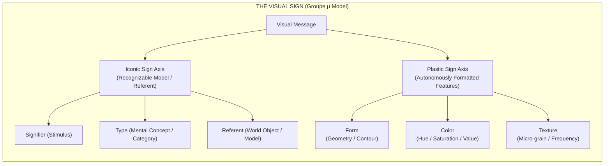

## 01. Beyond linguistic metaphors

For decades, visual semiotics was held back by what Groupe µ (the Liège group formed by Francis Élineau, Jean-Marie Klinkenberg, and their colleagues) called linguistic imperialism. Analysts tried to force pictures into frameworks borrowed from verbal grammar, treating pixels or brushstrokes like phonemes and entire compositions like sentences.

That borrowing created confusion. Words depend on arbitrary social conventions. Images, by contrast, act directly on human visual neurophysiology. In *Traité du signe visuel* (1992), Groupe µ split visual communication into two distinct systems: the iconic sign and the plastic sign.



This distinction cuts straight to how modern generative AI operates. Diffusion networks like Stable Diffusion, Midjourney, and FLUX do not understand physical objects or spatial mechanics. They manipulate plastic rhetoric while remaining blind to real-world referents.

---

## 02. Iconic triads and plastic autonomy

Current image models render convincing specular reflections and skin micro-textures alongside obvious physical errors, like six-fingered hands or table legs that disappear mid-air. That split happens because of how iconic recognition works.

Rather than using Charles Sanders Peirce's triad of Sign, Object, and Interpretant, Groupe µ models the iconic sign as a transformation across three specific poles: the Signifier ($SS$), which is the physical or digital stimulus on screen; the Referent ($RR$), which is the object in the world; and the Type ($TT$), which is the mental category stored in biological memory that connects $SS$ to $RR$.

$$\text{Iconicity}(\mathbf{SS}, \mathbf{RR}) = f_{\text{transformation}}(\mathbf{SS} \to \mathbf{TT}) \cdot \delta(\mathbf{TT}, \mathbf{RR})$$

A drawing of a cat works as an iconic sign because its visual stimulus ($SS$) matches the mental template ($TT$) of a cat in the viewer's brain, not because it holds an intrinsic physical link to a specific animal ($RR$).

### The autonomy of the plastic sign

Groupe µ demonstrated that pictures contain a second layer of meaning that operates independently of object recognition: the plastic sign. Plastic signs do not rely on real-world referents or category matching. They consist of three spatial parameters:

| Plastic Dimension | Physical / Computational Correlate | Perceptual Function |
| :--- | :--- | :--- |
| Form | Spatial coordinates and contours | Boundary definition and Gestalt grouping |
| Color | Spectral frequency, luminance, and chromaticity | Contrast, mood, and figure-ground separation |
| Texture | Spatial frequency distributions and micro-grain | Surface quality, density, and tactile cues |

While an iconic sign asks what an image depicts, a plastic sign asks how its spatial structure affects visual perception. Cézanne's angled brushstrokes, Mondrian's grid lines, or a high-contrast dither pattern trigger responses in the visual cortex before any object is identified.

---

## 03. Isotopy, alotopy, and visual rhetoric

Groupe µ defines visual rhetoric as a structured change that creates a deliberate deviation (alotopy) from a baseline expectation (isotopy).

> _"Rhetoric is not mere ornamentation; it is the deliberate operation of deviation (alotopy) from a spatial norm (grado zero), forcing the recipient to re-evaluate the visual message."_ — Groupe µ, *Traité du signe visuel*

Visual rhetoric relies on four core operations:

```text
RHETORICAL OPERATIONS MATRIX:
1. SUPPRESSION   ──(Removal)──────> Silhouette, vignette, cropped frame
2. ADJUNCTION    ──(Addition)─────> Overlarge borders, graphic overlays
3. SUBSTITUTION  ──(Replacement)──> Arcimboldo composite heads, visual puns
4. PERMUTATION   ──(Rearrangement)─> Reversible figures, spatial inversions
```

When an artwork breaks spatial continuity, such as René Magritte's *Le Viol* where a female torso replaces a face, it creates an alotopy. The viewer's visual system registers the tension between plastic continuity (the outline of a head) and iconic substitution (body parts in place of facial features), starting an active visual interpretation.

---

## 04. Generative models as plastic rhetoric engines

When a latent diffusion model trains on billions of captioned images, it does not build mental concepts ($TT$) or learn physical mechanics ($RR$). Instead, it maps statistical correlations across plastic values in a high-dimensional vector space:

$$\mathbf{z}_{\text{latent}} = \text{Encoder}(\text{Image}) \in \mathbb{R}^{d}$$

$$\text{Similarity}(\mathbf{z}_1, \mathbf{z}_2) = \frac{\mathbf{z}_1 \cdot \mathbf{z}_2}{\|\mathbf{z}_1\|_2 \|\mathbf{z}_2\|_2}$$

The model learns that prompts like "cinematic lighting" or "dithered texture" correspond to specific spatial gradients, color values, and edge distributions.

```text
COMPUTATIONAL FLOW IN GENERATIVE PIPELINES:
[PROMPT TOKENS] ──(Text Encoder)──> [LATENT VECTOR z] ──(UNet / DiT Denoising)──> [PLASTIC MANIFOLD]
                                                                                      │
                                                                       (Lacks Physical Grounding)
                                                                                      ▼
                                                                        [SYNTHETIC RHETORICAL ALOTOPY]
```

This training method produces a sharp divide in performance. Surface reflections, shadow gradients, and grain structures appear consistent because the model draws them from smooth gaussian distributions. At the same time, because the network lacks a model of 3D geometry or physical cause and effect, it regularly renders impossible digits or floating chair legs.

The human eye initially accepts the image because its plastic organization triggers immediate resonance in the visual cortex. Secondary inspection reveals that the iconic elements violate basic physical logic.

---

## 05. The reborde and indexical framing

Groupe µ gave careful attention to the frame or border, called the *reborde*. The frame acts as an indexical sign that separates the internal space of an image from the outside world.

In digital tools and generative interfaces, the frame becomes an active participant. Outpainting algorithms extend plastic textures past the original border, predicting surrounding space through local pattern repetition. Prompts, seed numbers, and bounding boxes enter the visual field itself, exposing the underlying software mechanics in the composition.

```text
+-------------------------------------------------------------------+
| INDEXICAL FRAME (REBORDE)                                         |
|  +-------------------------------------------------------------+  |
|  | ENUNCIATED PLASTIC SPACE                                     |  |
|  |  - Form: High-frequency dithered grid                       |  |
|  |  - Color: Midnight Slate (#1B2427) & Coral Red (#E84A5F)   |  |
|  |  - Alotopy: Iconic spatial rupture / Latent sampling        |  |
|  +-------------------------------------------------------------+  |
+-------------------------------------------------------------------+
```

---

## 06. Toward an autonomous plastic criticism

Groupe µ's *Traité du signe visuel* gives us a framework to analyze synthetic images without resorting to vague complaints about artificiality.

Synthetic image generators function as statistical plastic rhetoric engines, not artificial eyes. They adjust color contrast and surface grain with high precision, even as they remain detached from the physical objects they attempt to depict.

Understanding both axes allows designers and researchers to use plastic manipulation deliberately while recognizing the software constraints that shape digital perception.
