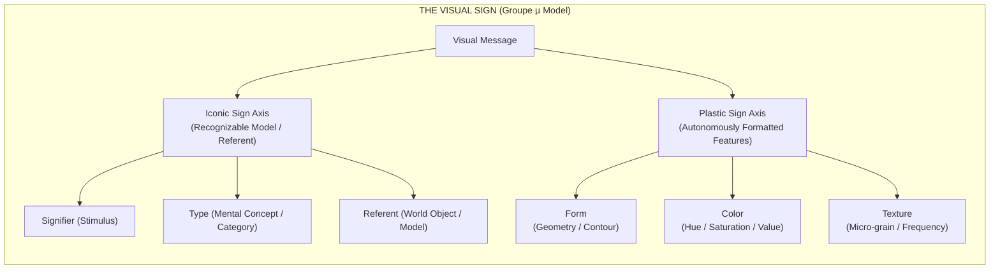

## 01. Beyond Art Criticism and Linguistic Imperialism

When semiotics gained momentum in the mid-twentieth century, visual analysis suffered from two major blind spots.

On one side stood institutional art criticism. Critics approached pictures through subjective appreciation, genre history, and impressionistic commentary rather than formal, scientific modeling. On the other side stood what **Groupe µ** (the Liège school of interdisciplinary semiotics founded by Francis Élineau, Jean-Marie Klinkenberg, Jacques Dubois, Francis Edeline, and their colleagues) called **linguistic imperialism**. Semioticians repeatedly tried to force visual communication into rigid verbal molds—slapping terms like "syntax," "phonemes," and "morphemes" onto brushstrokes or pixels without defining what those words actually meant in a visual field.

That metaphoric borrowing created confusion. Spoken and written words rely on arbitrary, unmotivated conventions. Visual images, by contrast, act directly on how our biological visual system extracts structure from light. 

In their landmark work _Traité du signe visuel: Pour une rhétorique de l'image_ (1992), Groupe µ set out to build an autonomous, scientific semiotics of the image. To do that, they established a clean distinction between **macrosemiotics** (the study of complete, contextual visual messages) and **microsemiotics** (the analysis of minimal visual units like lines, dots, colors, and textures), leading to one foundational division: **the Iconic Sign versus the Plastic Sign**.



This division isn't just an academic exercise. It cuts right to the heart of generative AI. Models like Stable Diffusion, Midjourney, and FLUX are often praised as "understanding" the visual world. But a rigorous semiotic audit reveals the opposite: **Generative AI has mastered plastic rhetoric while remaining structurally blind to iconic referents.**

---

## 02. The Neurophysiology of Vision & Perceptual Filtering

To build a visual semiotics free from linguistic bias, Groupe µ grounded their work in Gestalt psychology and neurophysiology. Seeing isn't a passive recording of photons; it's an active, discrete filtering process.

The retina-cortex system doesn't register raw continuous light. It uses biological mechanisms like **lateral inhibition**—where neighboring optical receptors inhibit each other to sharpen boundaries—to convert continuous visual input into distinct contrast edges, lines, and spatial enclosures. Our brain groups these early signals using Gestalt principles like proximity, orientation, and closure.

Groupe µ also drew attention to two key perceptual realities:

1. **Fractal Complexity in Nature:** Natural surfaces exhibit fractal geometries (as formulated by Benoît Mandelbrot). Because biological vision evolved to navigate these complex, irregular textures, our visual system instantly notices when synthetic surfaces lack micro-scale noise.
2. **Multi-stability and Oscillatory Reading:** When faced with ambiguous visual input, human vision doesn't register two meanings at once. It oscillates back and forth between alternative interpretations—switching rapidly between figure and ground, depth and flatness.

A scientific semiotics of the image must account for how these low-level perceptual filters feed into higher-level visual meaning.

---

## 03. The Triadic Iconic Model: Signifier, Type, and Referent

Historically, visual theory treated "iconic" signs as simple pictures that look like their real-world objects. Groupe µ rejected this naive definition of iconicity. Resemblance alone fails to explain why a line drawing, a high-contrast dithered icon, and a photorealistic render can all signify the exact same object.

Instead of Charles Sanders Peirce’s general triad (Sign, Object, Interpretant), Groupe µ formulated the iconic sign through a specific three-part relationship:

1. **Signifier ($SS$):** The concrete spatial pattern rendered on screen, paper, or canvas.
2. **Referent ($RR$):** The actual object, class, or model in the real world.
3. **Type ($TT$):** The abstract mental category or structural schema stored in biological and cultural memory that mediates between $SS$ and $RR$.

$$\text{Iconicity}(\mathbf{SS}, \mathbf{RR}) = f_{\text{transformation}}(\mathbf{SS} \to \mathbf{TT}) \cdot \delta(\mathbf{TT}, \mathbf{RR})$$

An image of a cat isn't iconic because its pixels physically match a real cat ($RR$). It's iconic because the spatial arrangement of its signifier ($SS$) undergoes a set of motivated transformations—geometric, analytic, or optical—that trigger the mental category of "cat" ($TT$) in human memory. As long as key structural features survive that transformation, recognition succeeds.

---

## 04. The Autonomy of Plastic Signs and Stylization

Groupe µ’s second major contribution was proving that an image contains an autonomous plane of meaning: the **Plastic Sign**.

Plastic signs don't depend on type recognition or real-world objects. They operate through three raw spatial dimensions:

| Plastic Dimension | Physical / Computational Correlate              | Perceptual Function                          |
| :---------------- | :---------------------------------------------- | :------------------------------------------- |
| **Form**          | Geometric spatial coordinates & contours        | Enclosure, orientation, and Gestalt grouping |
| **Color**         | Spectral frequency, luminance, and chromaticity | Tone, figure-ground separation, and contrast |
| **Texture**       | Spatial frequency distributions and micro-grain | Surface feel, tactile density, and grain     |

An iconic sign asks, *"What object is being depicted?"* A plastic sign asks, *"How does this visual arrangement act directly upon perception?"* Cézanne’s parallel *plumeados* brushstrokes, Mondrian’s black grid lines, or a high-contrast dithered texture hit the visual cortex long before the brain registers any recognizable scene.

### Stylization as Plastic Operation

Plastic rhetoric relies heavily on **stylization**—a systematic process where an artist or system selectively suppresses or exaggerates specific visual parameters:

- **Geometric Stylization:** Reducing complex contours to basic spatial polygons (e.g., De Stijl, cubism).
- **Textural Stylization:** Substituting natural surface noise with repeated graphic hatching or screen tones.
- **Chromatic Restriction:** Limiting palettes to complementary hues or extreme high-contrast pairs (e.g., Fauvism, 1-bit dither).

Stylization isn't just decorative simplification. By stripping away redundant visual noise, it directs perceptual focus, boosting legibility or emotional impact.

---

## 05. Visual Rhetoric: Isotopy, Alotopy, and the Four Operations

In Groupe µ's framework, **rhetoric** isn't fancy language. It's a regulated shift where an image breaks away from an established visual norm to create a deliberate effect.

They established three core terms for this mechanism:

- **Isotopy (Grade Zero / $G_0$):** The baseline norm or expected visual pattern. Isotopy can be general (grounded in human optics and cultural conventions) or local (established within a specific artwork).
- **Alotopy:** A deliberate deviation from the expected norm ($G_0$).
- **Re-evaluation:** The cognitive process where the viewer notices the deviation and re-interprets the visual message.

> _"Rhetoric is not mere ornamentation; it is the deliberate operation of deviation (alotopy) from a spatial norm (grado zero), forcing the recipient to re-evaluate the visual message."_ — Groupe µ, _Traité du signe visuel_

Visual rhetoric operates through four fundamental transformations across both iconic and plastic planes:

```text
RHETORICAL OPERATIONS MATRIX:
1. SUPPRESSION   ──(Removal)──────> Silhouette, vignette, cropped frame
2. ADJUNCTION    ──(Addition)─────> Overlarge borders, graphic overlays, Christo wraps
3. SUBSTITUTION  ──(Replacement)──> Arcimboldo composite faces, visual puns
4. PERMUTATION   ──(Rearrangement)─> Reversible figures, spatial inversions
```

When René Magritte paints a female torso in place of a face in _Le Viol_, he executes a rhetorical **substitution**. The plastic contour ($SS$) suggests a head, but the iconic content substitutes body features. The clash between plastic continuity and iconic surprise creates a classic visual **alotopy**.

### Iconoplasticity

Groupe µ coined the term **iconoplasticity** to describe the dynamic interaction between iconic and plastic signs within the same image. The iconic plane and the plastic plane can work in harmony, compete for attention, or openly contradict each other—generating tension, humor, or ambiguity.

---

## 06. The Semiotics of the Frame (*Reborde*)

Groupe µ devoted an entire section of _Traité du signe visuel_ to the **reborde** (the frame or border). They drew a sharp distinction between a **contour** (the perceptual edge that defines a figure inside an image) and a **frame** (an indexical sign that separates the enunciated visual space from the world outside it).

The frame is a hybrid boundary: it belongs to both the inside of the image and the space surrounding it. Groupe µ identified four distinct rhetorical manipulations of the frame:

1. **Desbordamiento (Overflow):** Visual elements break past the frame edge into the outer space.
2. **Amojonamiento (Contraction):** The frame shrinks inward, isolating or compressing the visual message.
3. **Imbordamiento (Frame Excess):** The frame becomes unnaturally thick or dominant, crowding out the content inside.
4. **Iconicization of the Frame:** The border itself stops being a neutral boundary and turns into an active, detailed sign (e.g., ornate painted margins, computational UI borders).

```text
+-------------------------------------------------------------------+
| INDEXICAL FRAME (REBORDE)                                         |
|  +-------------------------------------------------------------+  |
|  | ENUNCIATED PLASTIC SPACE                                     |  |
|  |  - Form: High-frequency dithered grid                       |  |
|  |  - Color: Midnight Slate (#1B2427) & Coral Red (#E84A5F)   |  |
|  |  - Alotopy: Iconic spatial rupture / Latent sampling        |  |
|  +-------------------------------------------------------------+  |
+-------------------------------------------------------------------+
```

---

## 07. Generative AI as a Plastic Rhetoric Engine

Why does Groupe µ’s framework matter so much for generative AI today?

When a latent diffusion model or Diffusion Transformer (DiT) trains on billions of image-text pairs, it doesn't build mental types ($TT$) or learn how physical objects exist in 3D space ($RR$). Instead, it maps statistical correlations between prompt tokens and mathematical features inside a high-dimensional vector space ($\mathbb{R}^d$):

$$\mathbf{z}_{\text{latent}} = \text{Encoder}(\text{Image}) \in \mathbb{R}^{d}$$

$$\text{Similarity}(\mathbf{z}_1, \mathbf{z}_2) = \frac{\mathbf{z}_1 \cdot \mathbf{z}_2}{\|\mathbf{z}_1\|_2 \|\mathbf{z}_2\|_2}$$

The model notices that prompt words like "cinematic lighting," "octane render," or "dithered texture" co-occur with specific spectral frequencies, color palettes, and edge distributions.

```text
COMPUTATIONAL FLOW IN GENERATIVE PIPELINES:
[PROMPT TOKENS] ──(Text Encoder)──> [LATENT VECTOR z] ──(UNet / DiT Denoising)──> [PLASTIC MANIFOLD]
                                                                                      │
                                                                       (Lacks Iconic Physical Grounding)
                                                                                      ▼
                                                                        [SYNTHETIC RHETORICAL ALOTOPY]
```

This explains the classic split in synthetic images:

- **Flawless plastic isotopy:** Highlights, subsurface scattering, volumetric fog, and surface textures look coherent because they are sampled from smooth gaussian probability spaces in latent math.
- **Frequent iconic breakdown:** The neural network has no internal model of skeletal mechanics or spatial causality. It will render hands with six fingers, arms that fuse into chairs, or shadows that point in contradictory directions.

To the human viewer, the render looks striking at first because its **plastic signs** satisfy early visual processing in the brain. Only upon closer inspection does the cognitive system notice that the **iconic signs** violate basic physical reality.

### Digital Reborde Operations

In generative AI software, the frame is actively manipulated:

- **Outpainting is computational *desbordamiento*:** The algorithm extends plastic textures beyond the canvas edge, predicting missing space from local statistical redundancy.
- **UI Enclosure:** Prompt input fields, seed numbers, and selection boxes act as an active, indexical *reborde*, keeping the computational machinery visible around the generated image.

---

## 08. Beyond "Fake Images"

Groupe µ’s _Traité du signe visuel_ gives us a precise vocabulary to analyze synthetic culture without falling into vague panics about "fake pictures."

AI image generators aren't imitating human sight or building mental models of the world. They are hyper-developed **plastic rhetoric engines**. They manipulate color, tone, geometry, and texture with mathematical precision, while remaining completely ungrounded from physical referents. By separating the plastic plane from the iconic plane, Groupe µ's work lets us see exactly how these tools work, where their aesthetic power comes from—and why their structural flaws inevitably appear.
