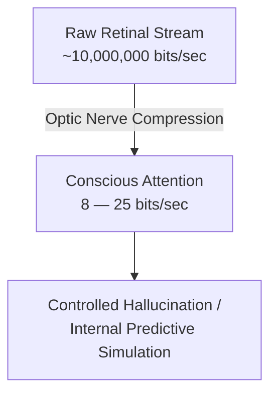

## 01. The compression crisis in our eyes

Most people picture eyes like digital cameras, streaming a steady high-res video feed straight into consciousness. 

Biophysics says otherwise.

The retina takes in roughly **$10^7$ bits per second** of raw light data. But by the time neural signals pass the optic nerve and hit conscious awareness, that stream chokes down to **8 to 25 bits per second**.

Consciousness simply can't handle ten million bits a second. To bridge the gap, the visual cortex runs as a prediction engine. It doesn't stream the world; it guesses it.

---

## 02. Foveal pinpoint vs. low-frequency haze

Full-resolution vision is surprisingly small. It's restricted to the **fovea centralis**—a tiny spot on the retina covering about 1 to 2 degrees of visual field. Hold your thumb out at arm's length; your thumbnail is about all you see in sharp detail at any given instant.

Everything else in your field of view is a low-resolution blur:

1. **High spatial frequencies (text, fine detail):** Require direct foveal focus and heavy metabolic energy.
2. **Low spatial frequencies (shapes, luminance, movement):** Route instantly through fast subcortical pathways to tell your neck and eyes where to point next.

Because your fovea can only look at one spot at a time, your gaze jumps around (saccades) based on a few competing cues:

- **Reflexes:** Sharp light changes, sudden motion, and face-like outlines capture your eyes automatically.
- **Motor schema:** Your eyes move ahead of your actions. When pouring coffee or negotiating traffic, your gaze lands on target coordinates milliseconds before your hands or feet move.
- **Learned priors:** Expectations steer focus. Drivers glance at street corners for stop signs; developers scan the top-right corner of a web page for search bars.

Instead of recording what's out there, the brain runs an internal simulation anchored by previous experience and broad visual cues. As long as incoming data matches the mental model, you perceive a smooth, uninterrupted world. As cognitive neuroscientists put it, vision is just a controlled hallucination that updates only when an assumption breaks.

---

## 03. What this means for interfaces & visual design

"Clean UI" and "intuitive layout" aren't purely visual choices. They're hacks for this bandwidth bottleneck.

Interfaces don't target human eyes—they target the brain's predictive shortcuts.

When a layout respects low-frequency visual structure—distinct groups, clear contrast, predictable placement—the brain's internal model runs without friction. Put a primary button in an odd corner or use washed-out text, and the simulation stumbles. The brain has to pause, re-aim the fovea, and waste precious conscious bandwidth figuring out what went wrong.

Good visual design doesn't mean adding more info. It means making sure the 99.9% your brain is making up actually matches what's on the screen.
