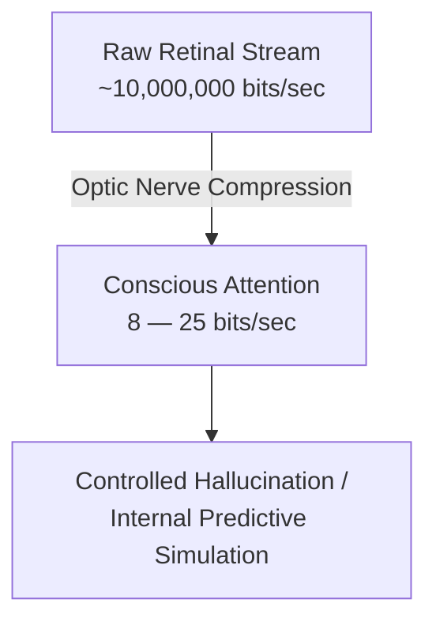

## 01. The compression crisis in our eyes

We tend to assume our eyes operate like high-resolution digital cameras, streaming an objective, edge-to-edge feed of the external world into consciousness.

The biophysics of vision tells a completely different story.

The human retina processes an incoming sensory torrent estimated at roughly **$10^7$ bits per second**. Yet by the time neural spikes pass through the optic nerve and filter through conscious awareness, bandwidth collapses to a trickle: barely **8 to 25 bits per second**.

To survive this astronomical compression ratio, the visual cortex doesn't bother relaying raw data. It runs as a **prediction engine**.

---

## 02. Foveal pinpoint vs. low-frequency haze

High-fidelity acuity is not evenly distributed across your eyes. It is confined strictly to the **fovea centralis**—a pinhead-sized notch in the retina that covers barely 1 to 2 degrees of your visual field (about the width of your thumbnail held at arm's length).

Everything outside that narrow spotlight is a blur of **low spatial frequencies**:

1. **High spatial frequencies (details & text):** Require direct foveal fixation and high metabolic energy.
2. **Low spatial frequencies (broad layout, luminance, motion):** Stream instantly through fast subcortical visual pathways, telling the brain where to aim next.

Because the fovea can only inspect one minute coordinate at a time, where your gaze lands is governed by three overlapping layers:

- **Biological reflexes:** Sudden movement, sharp luminance contrast, and biological contours immediately hijack attention.
- **Task-directed motor schemas:** Your gaze anticipates physical action. When buttering toast or negotiating traffic, saccades lock onto target coordinates milliseconds before the hands or feet initiate movement.
- **Cultural & environmental priors:** Learned regularities dictate attention. Drivers check crosswalks for stop signs, and software engineers expect search bars in top-right headers.

Rather than recording the world, the brain projects an internal simulation built on prior experience, mental schemas, and coarse contextual anchors. When that simulation doesn't encounter a prediction error, we perceive it as seamless reality. As cognitive neuroscientists put it: **reality is a controlled hallucination that only updates when its assumptions break.**

---

## 03. What this means for interfaces & visual design

When designers talk about "clean UI" or "intuitive layouts," they are rarely discussing aesthetics in a vacuum. They are negotiating this bandwidth bottleneck:

> **You are never designing for human eyes—you are designing for the brain's internal assumptions.**

When an interface respects low-frequency visual hierarchy—clear groupings, predictable contrast, consistent spatial anchoring—the user's predictive model runs effortlessly. But when an unexpected button position or low-contrast label breaks those spatial priors, the predictive simulation stumbles. The brain is forced to dump its cache, divert foveal focus, and spend scarce conscious bandwidth resolving the discrepancy.

Good visual design isn't about cramming more information onto the screen; it's about making sure the 90% your brain hallucinates matches what's actually there.
