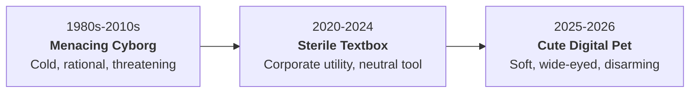

## 01. The Billion-Dollar Interface Inversion

For fifty years, Hollywood and tech branding told us what Artificial Intelligence was supposed to look like:

- Chrome skeletons with glowing red eyes
- Sterile blue holograms floating over military HUDs
- Minimalist enterprise textboxes with dark mode terminals

Then, in 2026, the biggest AI labs in the world made an abrupt U-turn.

OpenAI launched **Dots**: pastel blobs that wobble across your screen like sleepy kittens. xAI rolled out **Grok Bot**: a bouncy, animated desk companion. Meta took it even further with the **Muse Charm**: a physical keychain shaped like a 1996 Bandai Tamagotchi.



Why are multi-trillion-dollar companies dressing massive, nuclear-backed computing clusters in the visual language of nursery toys?

Because cuteness is the ultimate psychological growth hack.

---

## 02. The Evolutionary Trojan Horse

If an AI company gives you a cold, hyper-efficient robot to manage your life, your threat detection system stays on high alert:

- Every mistake feels like dangerous software failure.
- Every permission prompt (microphone, camera, reading private messages) feels like corporate surveillance.

Now swap the robot for a blushing pastel creature named Dot.

In evolutionary biology, this is known as the **Kindchenschema** (baby schema), first cataloged by ethologist Konrad Lorenz in 1943. Big eyes, rounded contours, and clumsy movements trigger an automatic caretaking instinct in the human brain.

```text
[COLD ROBOTIC AGENT]  ──> Triggers Threat Appraisal ──> High Permission Friction
[CUTE DIGITAL PET]    ──> Triggers Caretaking Instinct ──> Zero Friction Access
```

When a tool looks like a pet:

1. **Hallucinations become endearing quirks.** If an enterprise tool gives a wrong date, you file a bug report. If a pastel mascot makes a funny mistake, you laugh and screenshot it.
2. **Permission barriers evaporate.** You would never let a military drone watch your screen 24/7. But you will let a tiny virtual companion sit in the corner of your desktop all day.
3. **Retention shifts from utility to affection.** You cancel software subscriptions when you stop using a feature. You do not cancel a pet you have been feeding for three months.

---

## 03. Three Rules for Builders and Designers

What does this interface shift mean for product founders, designers, and marketers?

### 1. The Best UX Lowers Perceived Stakes
High-capability agents create anxiety. Lowering visual formality lowers the emotional friction of trying new tools. If you want users to explore complex workflows, make the entry point feel as low-stakes as playing a game.

### 2. Flaws Can Compound Retention
Perfection creates distance; vulnerability invites connection. In 2026, the products winning daily active retention are not the ones claiming 100% accuracy, but the ones whose personality makes failure forgivable.

### 3. Emotion Is the Only Real Moat
Raw model intelligence is becoming a commoditized utility. When every frontier lab has comparable reasoning speeds and context windows, the product that wins is the one the user actually *cares* about opening every morning.

---

## 04. The Question

Are you building an enterprise calculator, or are you building a companion that users invite into their daily routines?

And as designers, where do we draw the line between making software approachable and using cuteness to disarm critical judgment?
