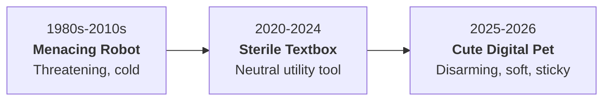

## 01. The Billion-Dollar Bait and Switch

For decades, tech branding told us what AI was supposed to look like:

- Chrome skeletons with glowing red eyes.
- Sterile blue holograms.
- Minimalist enterprise prompts in dark terminals.

Then 2026 arrived, and the biggest AI labs in the world pulled a massive U-turn:

- **OpenAI** launched **Dots**: pastel blobs that wobble across your screen like sleepy kittens.
- **xAI** rolled out **Grok Bot**: a bouncy cartoon desk mascot.
- **Meta** shipped the **Muse Charm**: a physical keychain that looks like a 1996 Tamagotchi.



Why are multi-trillion-dollar companies dressing massive nuclear-backed compute clusters in the visual language of nursery toys?

Because cute software gets away with things cold software could never dream of.

---

## 02. The Trojan Horse of Cuteness

If an AI company gives you a cold, hyper-efficient robot to run your computer, your defenses immediately spike:

- A wrong date on your calendar feels like dangerous software failure.
- A request for 24/7 camera, microphone, and email access feels like corporate surveillance.

Now swap the robot for a blushing pixel blob named Dot.

The human brain is hardwired to nurture small, round, clumsy things. Big eyes, soft curves, and awkward wobbles trigger an instant caretaking reflex that shuts down threat detection.

```text
[COLD ENTERPRISE BOT]  ──> Triggers Threat Appraisal   ──> High Permission Friction
[CUTE DIGITAL PET]     ──> Triggers Caretaking Reflex  ──> Zero Friction Access
```

Watch what happens when you turn software into a pet:

1. **Bugs become personality.** When an enterprise tool hallucinates, you cancel the subscription. When a blushing mascot makes a goofy mistake, you screenshot it and tweet: _"Look at him trying his best."_
2. **Permission barriers melt away.** You would never let a corporate surveillance tool record your screen all day. But you will let a virtual pet sit in the corner of your desktop for twelve hours straight.
3. **Churn becomes impossible.** You cancel SaaS tools when you stop using a feature. You do not cancel a pet you have been feeding for six months.

---

## 03. What Founders and Designers Need to Learn

`<irony>` If you are building products in the age of autonomous agents, take notes:

### 1. Utility is a commodity. Affection is a moat.

Every frontier lab has fast inference and large context windows. Raw intelligence is cheap. The product that wins is the one the user actually looks forward to seeing every morning.

### 2. Perfection is fragile. Personality absorbs mistakes.

Zero-error software does not exist in generative AI. If your interface looks serious and sterile, every error feels catastrophic. If your interface has warmth and vulnerability, your users will debug it with you.

### 3. Lower the visual stakes to unlock higher permissions.

High-capability agents create user anxiety. If you want people to hand over their inbox, calendar, and microphone, stop designing like a bank and start designing like a companion.`</irony>`

---

## 04. The Question

> Are you building an enterprise calculator that users tolerate during work hours? Or are you building a companion they refuse to close?

**And as builders: where is the line between making powerful tools approachable, and using cuteness to disarm critical judgment?**
