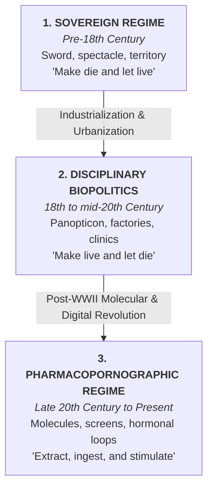
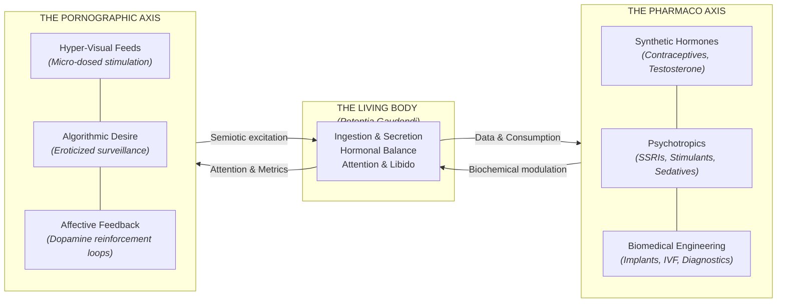
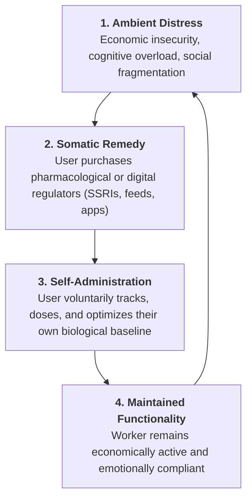

## 01. The Blind Spot Above the Waist

When Italian post-workerists and theorists of cognitive capitalism like Paolo Virno, Michael Hardt, Antonio Negri, and Franco "Bifo" Berardi diagnosed the shift from industrial Fordism to post-Fordism, they placed their bets on the mind.

They argued that factory assembly lines had been replaced by communicative networks, linguistics, and cognitive labor. The modern worker was no longer defined by physical muscle, but by the "general intellect": the capacity to process symbols, communicate through interfaces, and navigate semiotic flows.

Yet in their rush to celebrate immaterial labor, these theorists committed a fundamental oversight. As philosopher **Paul B. Preciado** pointed out in _Testo Yonki_, their critique of late capitalism stopped dead at the waist.

> _"Post-Fordist theory describes contemporary capitalism as if workers were disembodied brains floating above keyboards. It missed the colossal biochemical, sexual, and pharmacological apparatus that was constructed alongside the microprocessor."_ — Paul B. Preciado, _Testo Yonki_

While theorists debated communicative networks, `the post-World War II economy was building an entirely new infrastructure of somatic control`. The emergence of mass-synthesized hormones (contraceptive pills, testosterone, anabolic steroids), psychiatric pharmaceuticals (SSRIs, anxiolytics, amphetamines), and an omnipresent pornographic and digital-visual apparatus did not run parallel to capitalism. They became its core engine.

Capitalism did not dematerialize into pure software. It burrowed inward, transforming the molecular and affective interior of the human body into an industrial production site.

---

## 02. The Genealogy of Power: From Sovereignty to Biopolitics

To understand Preciado's rupture, we must first trace the philosophical trajectory laid out by **Michel Foucault**.

He documented two major historical regimes of power before sketching the beginnings of modern control:



### 1. The Sovereign Episteme: The Right of the Sword

In classical sovereignty, power belonged to the monarch. It was fundamentally a power of **subtraction and deduction**: the sovereign could seize land, confiscate goods, demand taxes, or demand life. Its guiding principle was summarized by Foucault as the right to **"make die and let live"** (_faire mourir et laisser vivre_). If you obeyed and paid your tribute, the sovereign left your everyday bodily existence largely unmanaged.

### 2. The Biopolitical Shift: Managing Life

Between the late eighteenth and early nineteenth centuries, the explosion of urban populations and industrial machinery rendered sovereign violence inefficient. Power shifted from destroying life to **cultivating, optimizing, and regulating life**: the imperative to **"make live and let die"** (_faire vivre et laisser mourir_).

Foucault split this `biopower` into two coordinated poles:

- **Anatomopolitics (The Individual Body):** Disciplinary institutions (schools, barracks, prisons, hospitals, and factories) used surveillance and rigid spatial schedules to train the human body into a docile, productive machine.
- **Biopolitics of Populations (The Species Body):** State apparatuses used statistical registries, actuarial tables, birth rates, hygiene policies, and demographic charts to manage the biological vitality of the population as a whole.

### 3. Governmentality: Power Without a Central Throne

Crucially, Foucault demonstrated through his lectures on **governmentality** that power is not a monolithic structure held by a king or state. Governmentality describes the _mobile network of techniques, practical rationalities, and self-regulating rituals through which human conduct is guided_. The state is not a transcendent monster, but the temporary institutional crystallization of countless everyday governance practices.

---

## 03. The Pharmacopornographic Episteme

Foucault died in 1984, precisely as the third transformation was accelerating. He analyzed the birth of the clinic and the Victorian asylum, but he did not witness the widespread commercialization of oral contraceptives, the global market for synthetic psychotropics, or the rise of internet pornography and algorithmic social feeds.

Preciado steps into this gap by naming our contemporary regime the **pharmacopornographic episteme**.

| Historical Dimension     | Disciplinary Biopolitics (Foucault)        | Pharmacopornography (Preciado)                                    |
| :----------------------- | :----------------------------------------- | :---------------------------------------------------------------- |
| **Primary Architecture** | Enclosed spaces: schools, clinics, prisons | Ingestible chemistry, digital screens, subcutaneous implants      |
| **Locus of Control**     | External surveillance (The Panopticon)     | Internalized consumption (Micro-dosing, dopamine loops)           |
| **Production Target**    | Muscular labor and factory discipline      | _Potentia gaudendi_ (Orgasmic force, attention, hormonal balance) |
| **Core Commodities**     | Steel, textiles, manufactured goods        | Synthetic hormones, SSRIs, pornography, algorithmic engagement    |
| **Subjective Ideal**     | The disciplined worker / dutiful citizen   | The self-optimizing, biochemically modulated user                 |



### The Pharmaco Axis: Ingested Discipline

> In the **disciplinary era**, if power wanted you to work faster, an overseer stood behind you with a stopwatch. In the **pharmacopornographic era**, you swallow a prescribed stimulant or an antidepressant so that you can self-regulate your emotional capacity to keep working.

Discipline is no longer an external wall you encounter. It is a molecule that crosses your blood-brain barrier. The birth control pill (first synthesized in the 1950s from Mexican wild yams) severed reproduction from sexuality, allowing the pharmaceutical market to directly monetize and regulate reproductive physiology on an industrial scale.

### The Porno Axis: The Industrialization of Desire

Simultaneously, pornography stopped being a marginal illicit trade and became the vanguard of digital telecommunications. From early VHS formats and subscription billing to high-speed video streaming, data compression, and webcam platforms, the infrastructure of the internet was engineered around the transmission of erotic stimuli.

Preciado argues that `modern capitalism does not merely produce goods; it produces excitation, frustration, and somatic stimulation`. The capacity for desire, pleasure, and bodily intensity (which Preciado terms _potentia gaudendi_, or orgasmic force) is captured and metabolized by streaming feeds, recommendation algorithms, and targeted feedback loops.

---

## 04. The Body as a Technical Artifact

One of Preciado's most radical philosophical contributions is dismantling the naturalist illusion of sex and gender.

Traditional political philosophy treated gender as a natural biological substrate onto which culture places roles. Post-structuralists like Judith Butler showed that gender is performative: a sequence of repeated linguistic and social gestures.

Preciado goes one step further: **gender is a techno-prosthetic artifact.**

```text
[NATURALIST ILLUSION]   ──> Sex is an immutable biological given.

[PERFORMATIVE CRITIQUE] ──> Gender is a repeated social script (Butler).

[PHARMACOPORNOGRAPHY]   ──> Sex & Gender are industrially engineered
                            biochemical products (Preciado).
```

Sexuality and gender in the twenty-first century are produced through:

1. **Chemical Prosthetics:** Birth control pills, hormone replacement therapy, testosterone gels, puberty blockers, and anti-androgens.
2. **Surgical & Diagnostic Protocols:** Clinical classifications, aesthetic surgeries, chromosomal testing, and medical categorization.
3. **Digital Semiotics:** Visual media feeds, dating app interfaces, and avatar systems that train desire to recognize specific algorithmic archetypes.

The body is not an untouched sanctuary of nature standing outside of capital. It is a biological platform continuously patched, updated, and modulated by industrial technologies.

---

## 05. Molecular Governmentality and Self-Administered Power

Why is the pharmacopornographic regime so extraordinarily durable? Because it operates through the mechanics of **advanced governmentality**.

In a classic authoritarian regime, the state must spend immense resources building watchtowers, hiring police officers, and constructing prisons. If the population revolts, the machinery of coercion is visibly external and fragile.

In the pharmacopornographic era, surveillance and control are **outsourced to the consumer**:



\*\*- We buy our own smartphones and carry the tracking device everywhere voluntarily.

- We monitor our own sleep cycles, heart rates, and screen time using wearable biometric sensors.
- We visit clinics and pharmacies to pay for the molecules required to regulate our sleep, anxiety, focus, and libido\*\*.

Power no longer needs to force us into a disciplinary barracks. We willingly convert our biological and affective lives into quantifiable streams of consumption and telemetry. `The panopticon has been swallowed`.

---

## 06. Emancipatory Somatopolitics: The _Somateca_

If power has become molecular, semiotic, and prosthetic, how is resistance possible?

Preciado rejects two common political traps:

- **The Nostalgia for Natural Purity:** The reactionary fantasy that we can retreat into an "untouched biological nature" or pre-technological authenticity. Nature is not an uncorrupted garden; it is a category historically constructed by power to justify exclusion.
- **Passive Technological Surrender:** Accepting the commercial monopolies of Big Pharma and platform capital as inevitable destinies.

Instead, Preciado proposes **somatopolitics** and the concept of the **somateca**: recognizing the living body as an open archive of technical tools, biological memories, and potential transformations.

```text
RESISTANCE STRATEGIES IN THE PHARMACOPORNOGRAPHIC ERA:

1. Somatic Hacking:
   Reclaiming pharmacological tools and molecular knowledge from
   corporate patents and restrictive medical gatekeepers.

2. Epistemic Dis-identification:
   Refusing the binary diagnostic categories invented by 19th-century
   psychiatry and 20th-century market demographics.

3. Open-Source Hormonal & Technological Literacy:
   Democratizing access to bio-technologies, digital tools, and bodily autonomy.
```

To resist a regime that operates below the waist, politics can no longer limit itself to parliamentary debates, labor strikes over assembly hours, or abstract cognitive critiques. It must become somatic. It must understand how molecules, algorithms, and desire interact to shape our sense of self.

> True autonomy in the twenty-first century begins when we recognize our bodies not as passive consumers of corporate chemistry and digital feeds, but as active, experimental authors of our own biological and political existence.

---

_Next time, we'll try to go one step further, and analyze the pharmacopornographic regime through the lens of the current AI-dominated zeitgeist and its implications for the future of the body and politics._
