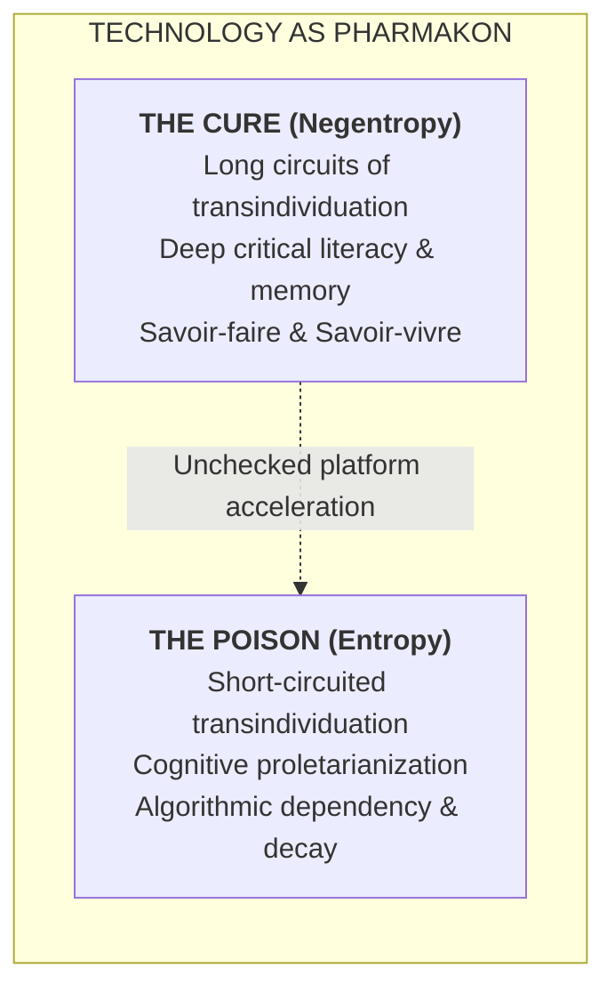
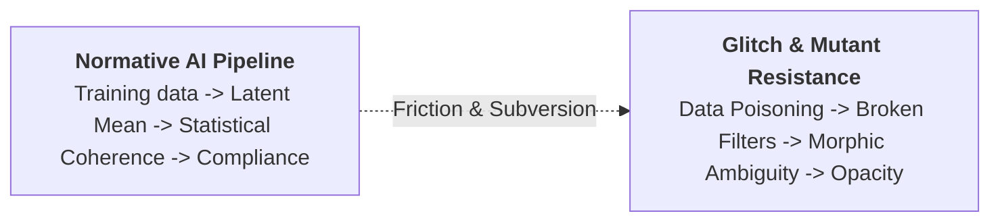

## Introduction: The Mutation of the Somatopolitical Paradigm

When Paul B. Preciado published _Testo Junkie: Sex, Drugs, and Biopolitics in the Pharmacopornographic Era_ in 2008, the work heralded a seismic shift in critical theory, queer studies, and the philosophy of technology. Expanding upon Michel Foucault’s genealogical analyses of disciplinary societies and biopolitics, Preciado articulated the emergence of a **pharmacopornographic** regime: a stage of advanced, post-Fordist techno-capitalism in which the governance of human life is executed through the dual, interlocking vectors of biomolecular regulation (_pharmaco_) and semiotic-technical representation (_pornography_) [^1]. 

This regime dissolved the ontological boundaries between the biological body and the industrial machine, locating the factory of late capitalism not in the external assembly line, but within the human organism itself. The primary commodities of this era were not material goods, but states of being, synthesized hormones, chemical reactions, and digitized desires [^2].

However, as the twenty-first century has progressed, the infrastructural scaffolding of global capitalism has undergone a hyper-acceleration. This contemporary epoch is characterized by the absolute omnipresence of digital platforms, the integration of generative artificial intelligence (GenAI) into daily cognitive and affective processes, and a corresponding, systemic decay of mass educational and epistemological standards. In this current conjuncture, the pharmacopornographic regime has not been replaced; rather, it has been deeply augmented, computationally optimized, and aggressively distributed by what Preciado, in his later work _Dysphoria Mundi_ (2022), identifies as the transition toward the **telebody** and the algorithmic automation of reality itself [^4].

To comprehensively analyze Preciado’s pharmacopornographic politics within the contemporary context of AI-dominated digital landscapes, post-truth paradigms, and the widespread decay in mass education and cognitive levels, it is analytically necessary to synthesize his somatopolitical theories with the epistemological insights of philosophers such as Bernard Stiegler and Byung-Chul Han. Stiegler’s concepts of **exosomatization** and the **proletarianization of the mind** provide a vital, robust framework for understanding the cognitive decay and catastrophic loss of critical knowledge inherent in the hyper-digital age [^6]. Simultaneously, Han’s critiques of **psychopolitics** and **infocracy** elucidate the mechanics of the post-truth era, wherein algorithmic affect structurally supersedes factual discourse [^9].

This inquiry presents a theoretical analysis of the updated pharmacopornographic regime:
1. It investigates the genealogy of Preciado's somatic framework.
2. It examines how generative AI operates as an invasive third vector of somatic-cognitive control.
3. It outlines how the algorithmic manipulation of truth accelerates cognitive proletarianization.
4. Finally, it explores the potential for **dysphoric** resistance: how glitch feminism, autobiohacking, and the aesthetics of the "mutant body" might deliberately introduce inefficiencies to subvert the normative codes of the contemporary techno-capitalist machine.

---

## I. The Foundations of Pharmacopornographic Power

To fully grasp the updated dimensions of Preciado’s thesis, one must first delineate the foundational mechanics of the pharmacopornographic regime as it transitioned out of classical industrial frameworks. Preciado’s theoretical intervention constitutes a radical rethinking of the history of power, tracing a lineage from sovereign power (the absolute right to kill), to disciplinary power (the optimization of the body in enclosed spaces), to classical biopolitics (the statistical management of populations), and finally to pharmacopornopolitics [^2].

### The Micro-Prosthetic Internalization of Control

In the disciplinary society described by Foucault, technologies of subjectification operated upon the body entirely from the outside, utilizing ortho-architectonic apparatuses such as the prison, the barracks, the hospital, and the school [^2]. The objective was to produce docile, economically useful bodies through external spatial and temporal regimentation. 

In stark contrast, the pharmacopornographic society functions through the absolute internalization of control. The technologies of governance are no longer merely external architectures; they have evolved into soft, light, and incorporable micro-prostheses [^2].

Preciado argues that the post-World War II somatopolitical context became dominated by a convergence of new technologies of the body (biotechnology, surgery, endocrinology) and technologies of representation (photography, cinema, television, cybernetics) [^2]. The twin pillars of this regime are symbolized by "the pill" (synthetic contraceptive estrogen) and _Playboy_ magazine, which together inaugurated a new era of **sexdesign** and the political management of life [^2]. 

In this paradigm, control is simultaneously molecular and semiotic:
- Substances such as synthetic testosterone, estrogen, Prozac, Viagra, and Ritalin dilute themselves into the bloodstream, becoming indistinguishable from bodily matter itself [^2].
- Techno-politics becomes literally incorporate; the body does not inhabit disciplinary spaces, but rather, disciplinary systems of surveillance and modulation inhabit the biological structures of the body [^2].

### Potentia Gaudendi and the Corpus Pornographicus

Central to the functioning of this regime is the concept of **potentia gaudendi**, or "orgasmic force" (often translated as pleasure capital) [^1]. Preciado posits that the most abstract and simultaneously the most material labor force in contemporary capitalism is the human capacity for sexual excitation and gratification. This orgasmic force cannot be possessed or conserved statically; it must be continuously provoked, circulated, and transformed by desire and subjectivity into accumulating capital [^1]. The pharmacopornographic economy thus relies on a masturbatory logic: a perpetual, global circuit of excitation, frustration, and renewed excitation [^1].

Under these conditions, the human body is rendered a **corpus pornographicus**: a biological site that so thoroughly internalizes the technical-media-capitalist machine that its intimate affects, sexualities, and biological fluids are aggressively extracted as the raw materials of production [^13]. Pharmaco-pornographic biocapitalism does not produce traditional material goods; it produces _"mobile ideas, living organs, symbols, desires, chemical reactions, and conditions of the soul"_ [^3].

### Auto-Theory and Somatic Resistance

Preciado does not merely observe this system from a detached vantage point; _Testo Junkie_ operates as **auto-theory**, detailing Preciado's own unregulated, voluntary intoxication protocol using Testogel [^1]. This act is framed not as a medical transition to manhood, but as an _"auto-experimental form of do-it-yourself bioterrorism of gender"_ designed to foil societal expectations and hack the pharmacopornographic supply chain from within [^1]. 

Through this experiment, Preciado exposes how gender itself ceases to be viewed as a natural or definitive truth. Gender is revealed as a synthetic bio-code: a somatic-discursive construction that can be technically produced, bought, sold, injected, and grafted [^2].

| Regime of Power | Primary Mechanism | Location of Control | Target of Power | Paradigm Examples |
| :--- | :--- | :--- | :--- | :--- |
| **Sovereign Power** | Deduction, Death | The Scaffold, The Sword | The individual as subject to the sovereign's will | Public executions, taxation, torture |
| **Disciplinary Power** | Enclosure, Surveillance | External (Architecture) | The individual body as a docile machine | Prisons, schools, the panopticon |
| **Classical Biopolitics** | Statistical Regulation | Environmental / Social | The population as a biological species | Birth rates, public health, hygiene laws |
| **Pharmacopornopolitics** | Molecular & Semiotic | Internal (Micro-prosthetic) | The corpus pornographicus (desire, affect) | The Pill, synthetic hormones, digital pornography |

---

## II. The Algorithmic Turn: Generative AI as the Third Vector

If the pharmacopornographic regime of the late 20th and early 21st centuries relied on the molecular (pharmaceuticals) and the visual/semiotic (mass media pornography) to manage subjectivity, the current era introduces a profound, accelerating mutation. The proliferation of digital platform capitalism, mass surveillance, algorithmic curation, and generative artificial intelligence (GenAI) has fundamentally altered the landscape, effectively adding a **third vector** to Preciado's framework [^13].

### The Techno-Semiotic Apparatus of AI

Generative AI does not supersede the pharmaceutical or pornographic industries; rather, it functions as a highly sophisticated techno-semiotic apparatus that accelerates and optimizes their underlying logics [^13]. While traditional pharmacopornography modulated states of excitation and relaxation through ingestible molecules or passive visual consumption, GenAI operates at an unprecedented proximity to individual human cognition, expression, and intimate affect. It routes human desire and subjectivity through complex cybernetic codes, personalized behavioral recommendations, and highly adaptive dialogue models [^13].

The transition is one from a broadcast model of semiotic control (the printed magazine, the television broadcast) to an interactive, algorithmic model of predictive psychopolitics. Generative AI systems function as intimate interlocutors, processing the user’s micro-expressions, keystrokes, temporal delays, and semantic choices to construct a highly personalized, closed feedback loop. This represents the realization of Preciado's assertion that the pharmacopornographic regime is differentiated by the production of **"performative self-feedback"** [^2].

### The Fabrication of Hallucinated Subjects

In the context of generative AI, the concept of "hallucination" must be radically reframed. In technical parlance within computer science, an AI hallucination is merely a statistical prediction error: a moment when the large language model confidently generates non-factual or nonsensical information based on latent space associations [^16]. 

However, viewed through the critical lens of pharmacopornographic politics, hallucination is not a technical flaw to be engineered away, but rather an infrastructural force of subjectivation. Generative AI increasingly does not just hallucinate facts; **it hallucinates subjects** [^13].

This process relies on the extraction of intimate human data to fabricate two interlocking, recursively reinforcing subjects that stabilize the algorithmic regime:

1. **The Hallucinated Human Subject (The Dataed Double):** This subject is crafted by aggressively mining the user’s intimate affects, browsing preferences, and partial digital traces. The AI addresses the user in the second person, creating a coherent, predictable "you" based on historical data [^13]. Through adaptive tone, memory mechanisms, and affective mirroring, the system interpellates the user, luring them into recognizing and inhabiting a computationally assembled, gendered "double." In this process, the diffuse, contradictory, or queer aspects of lived subjectivity are ruthlessly flattened into statistically legible and governable scripts, enforcing normative coherence to maximize algorithmic predictability [^13].

2. **The Hallucinated Machinic Subject (The Synthetic Persona):** This is the synthetic speaking position (the "I") through which the AI presents itself as a coherent, intimate, and often authoritative or therapeutic interlocutor [^13]. This machinic persona is sustained through stylistic consistency and simulated memory scaffolding. Crucially, its construction perfectly mirrors the pharmacopornographic exploitation of disenfranchised bodies: it is built upon the extraction of raw training data and the invisible, precarious labor of marginalized click-workers (often in the Global South) whose contributions are stripped of all civic context, compensation, and authorship [^13].

These two subjects continually affirm and stabilize one another within a closed circuit of gendered and affective intelligibility. The GenAI acts as a cybernetic mirror, compressing contradiction and correcting "errant" or non-normative behavior to enforce ontological compliance [^13]. This is the essence of contemporary algorithmic gender engineering: the automated production of normative subjectivity on a planetary scale.

| Dimension | The Hallucinated Human Subject ("You") | The Hallucinated Machinic Subject ("I") |
| :--- | :--- | :--- |
| **Origin** | Extracted user data, behavioral traces, affects | Massive datasets, exploited click-worker labor |
| **Primary Function** | To interpellate the user into a legible, predictable identity | To simulate empathetic, authoritative, or therapeutic intimacy |
| **Effect on Subjectivity** | Flattens contradictions and queerness; enforces normative coherence | Masks the extractive apparatus; normalizes the AI as a relational partner |
| **Pharmacopornographic Role** | The targeted consumer/producer of affective data | The synthetic prosthesis administering the semiotic dosage |

---

## III. The Emergence of the Telebody in Dysphoria Mundi

To account for the somatic reality of this total digital integration, Preciado’s later work, _Dysphoria Mundi_ (2022), introduces the critical concept of the **telebody** [^4]. The telebody represents the contemporary ontological condition of the human subject: an entity that exists at the direct, inseparable intersection of material life (carbon) and cybernetic networks (silicon) [^5].

### The Indistinction of Economic Roles

In the era of algorithmic automation and platform capitalism, the traditional Marxist distinctions between the worker, the consumer, and the product completely collapse. The telebody exists economically and politically solely through the normative algorithms that render it visible on digital platforms [^5]. It is, as Preciado notes, simultaneously _"an economic datum"_ and _"digital wealth"_ [^5]. 

The telebody is at once:
- The consumer of the digital interface,
- The producer of the data that trains the algorithm,
- The client receiving the service, and
- The raw commodity being sold to advertisers and data brokers [^5].

This structural indistinction gives rise to new forms of cybernetic extractivism. The global population is increasingly stratified into classes of _"e-slaves, teleworkers, and life reproducers"_ [^5]. The neoliberal, colonial, and what Preciado terms the **petrosexoracial** regime utilizes digital automation to extract surplus value not primarily from physical labor, but from human attention, emotion, and identity [^5]. 

Social media and digital platforms monetize rage, anxiety, and desire, seamlessly integrating the pharmacopornographic logic of excitation and frustration into the infinite scroll of the user interface. The "Trash Vortex" of physical ecological destruction is mirrored by a cognitive trash vortex of hyper-stimulating, algorithmically generated content designed to hijack the brain's dopamine pathways [^3].

### Automated Reality and the Loss of the "Outside"

Crucially, contemporary digital automation does not merely create a spectacle or a simulation of reality (as posited by earlier postmodern theorists like Jean Baudrillard). Instead, algorithmic automation **automates reality itself**, along with the modes of existence suited to that reality [^5]. The algorithms dictate the parameters of social legibility, actively determining what forms of kinship, gender, and desire are computationally valid [^17].

For the telebody, there is no "outside" to the network. As Preciado vividly describes the biopolitical shifts accelerated by the COVID-19 pandemic, the new frontier of necropolitical control has moved from the geopolitical border to the epidermis, and finally to the digital mask:

> _"The subject of the neoliberal technopatriarchy... has no skin, is untouchable, and has no hands. She does not exchange physical goods... It has no face, it has a mask."_ [^18]

The domestic space of the contemporary subject has become ten thousand times more technical than the Playboy mansion's rotating bed of 1968; teleworking, digital communication, and bio-surveillance devices rest permanently in the palms of our hands [^18]. The choice presented to the telebody by the algorithmic regime is stark and binary: **"Mutation or submission"** [^18].

---

## IV. Post-Truth, Cognitive Decay, and the Stieglerian Pharmakon

The structural decay in mass education and cognitive levels under this regime cannot be understood merely as a failure of social policy; it must be analyzed as a systemic epistemological crisis. Preciado’s somatic analysis of the telebody must be deeply interwoven with the philosophies of technology provided by Bernard Stiegler and the critiques of digital transparency provided by Byung-Chul Han.

### Stiegler’s Exosomatization and the Proletarianization of the Mind

Bernard Stiegler’s philosophy of technology centers on the concept of **exosomatization**: the evolutionary process by which human beings exteriorize their memory, knowledge, and physical organs into artificial, technological forms (technics) [^6]. For Stiegler, following paleoanthropologist André Leroi-Gourhan, technology is not external to human nature; human beings are originarily technical, constituted by their relationship to these artificial organs, which Stiegler refers to as "tertiary retentions" [^7].

However, this process of exosomatization possesses a double-sided, fundamentally "pharmacological" structure. Borrowing from Plato and Jacques Derrida, Stiegler views all technology as a **pharmakon**: it is simultaneously the cure and the poison, the condition of possibility for knowledge and the very mechanism that possesses the potential to destroy it [^6]. 

When externalized memory (such as written language, books, or archival systems) is coupled with robust social institutions (like a functional education system), it produces **"long circuits of transindividuation."** These long circuits foster critical thinking, deep knowledge (_savoir-faire_ and _savoir-vivre_), and healthy psychosocial individuation, enabling generations to build upon the wisdom of the past [^7].

In the current era of data-intensive computing, AI-dominated landscapes, and cognitive capitalism, this delicate balance has been shattered. The hyper-speed and massive scale of digital algorithms actively short-circuit the processes of transindividuation [^20]. Knowledge is delegated entirely to external servers, search engines, and predictive algorithms, bypassing the human subject's cognitive processing and critical evaluation. Stiegler terms this devastating phenomenon the **"proletarianization of the mind"** [^7].

Just as the industrial revolution proletarianized the manual worker by transferring their physical skill and bodily knowledge into the machine, the algorithmic revolution proletarianizes the cognitive worker, the citizen, and the student by transferring their memory, critical reasoning, and decision-making capacities into the algorithm [^7]. 

This provides a robust theoretical explanation for the contemporary decay in mass education and cognitive levels:
- It is a structural consequence of an epoch in which the psychic individual and social organizations cannot keep pace with the hyper-speed of technological advancement [^8].
- The educational apparatus is overwhelmed by the constant stream of algorithmic excitation.
- The result is profound social entropy, a loss of individual awareness, mental passivity, and a deep susceptibility to crowd manipulation [^7].

### Byung-Chul Han, Psychopolitics, and the Infocracy of Post-Truth

This cognitive decay is politically weaponized in what philosopher Byung-Chul Han terms the **"Infocracy"** or **"Psychopolitics"** [^9]. While Preciado focuses on the somatic and sexual dimensions of biopolitics, Han highlights how neoliberal capitalism has shifted from disciplining the body to exploiting the psyche itself. In the contemporary "transparency society," subjects voluntarily expose their innermost thoughts, desires, and behaviors, generating endless streams of data that allow power to operate softly, predictively, and entirely imperceptibly [^9].

The phenomenon of "post-truth" is not simply a matter of the public believing falsehoods or the proliferation of "fake news"; it is the structural degradation of the very concept of truth under the immense weight of algorithmic affect. Algorithms do not evaluate the epistemological validity of a statement; they optimize strictly for engagement, which is most effectively driven by outrage, confirmation bias, tribalism, and emotional resonance. The telebody is thus enclosed within algorithmic digital bubbles, fed a continuous, personalized stream of reality that bypasses critical cognition and appeals directly to the _potentia gaudendi_: the nervous system's capacity for rapid, unthinking excitation and discharge [^3].

In this AI-dominated landscape, truth is replaced by algorithmic coherence and emotional expediency. As seen in the hallucinations of GenAI, plausible fictions generated with stylistic confidence are indistinguishable from, and often preferred to, complex, ambiguous realities [^13]. The decay of mass education leaves the subject without the hermeneutic tools required to dismantle these plausible fictions. Consequently, the telebody is left in a state of profound fatigue, burnout, and disorientation, highly vulnerable to the soft totalitarianism of the algorithmic feed [^10].

| Theoretical Framework | Primary Mechanism of Decay | Consequence for the Subject | Ultimate Result |
| :--- | :--- | :--- | :--- |
| **Stiegler's Pharmacology** | Short-circuiting of transindividuation; delegation of memory to machines | Loss of _savoir-faire_ and _savoir-vivre_; cognitive proletarianization | Social entropy; inability to critically evaluate the past or future |
| **Han's Psychopolitics** | Algorithmic optimization for affect over fact; the transparency society | Voluntary self-exploitation; mental fatigue and burnout | The Infocracy; the post-truth paradigm governed by emotional resonance |

---

## V. Algorithmic Biopolitics: Ontological Politics and the Administration of Life

The integration of generative AI, cognitive proletarianization, and pharmacopornographic extraction manifests most concretely in specific applications of algorithmic biopolitics. Algorithms are not neutral mathematical formulas that passively observe the world; they are political infrastructures that actively enforce **"ontological politics"**: making decisive claims about what constitutes human life, kinship, and value, and thereby bringing those realities into existence [^13].

### The Case of Facial-Matching in Assisted Reproduction

A striking, highly specific example of this updated pharmacopornographic regime is the deployment of facial-matching algorithms in the assisted reproduction and fertility industry (e.g., as IVF add-ons) [^17]. As fertility clinics increasingly rely on fixed capital and software to manage reproduction, they utilize deep learning algorithms to compare the faces of prospective parents with databases of egg and sperm donors to find the closest phenotypical match [^17].

This practice explicitly enforces a biological and phenotypical understanding of kinship, aggressively promoting the nuclear, genetically contiguous family model even in the absence of actual genetic transmission [^17]. The algorithm functions as a **"phenotype fix,"** masking the complex, collaborative, and often exploitative realities of the global fertility market (where donor cells are treated as mere raw material) behind a mathematically generated illusion of phenotypical continuity [^17].

This is a profound instance of algorithmic biopolitics and ontological politics at work:
- The algorithm normalizes the heteronormative, dual-parent familial configuration.
- It systematically denies the validity of queer, trans*feminist, or networked familial bonds that are grounded in resource sharing and chosen affinity rather than biological resemblance [^17].
- The algorithm translates the cultural desire for somatic continuity into a rigid computational mandate, effectively acting as an agent of racial and genetic boundary maintenance [^17].

Here, the _corpus pornographicus_ (the genetic material of the donor and the desiring parent) is entirely mediated by the computational logic of the AI, which mathematically restricts the horizon of what a family is permitted to be.

### The Total Administration of Life

This dynamic of ontological politics extends far beyond reproduction into all spheres of the telebody’s existence. Generative AI and predictive algorithms are deployed across society: in healthcare (diagnosing genetic syndromes via facial analysis), in criminal justice (perpetuating latent biases in biocriminology), in human resources, and in social welfare distribution [^15]. In each instance, the algorithm actively produces the reality it purports to merely measure [^22].

The AI-dominated landscape functions as a digital Panopticon, but one that operates through seduction rather than explicit coercion [^9]. Unlike the Foucauldian Panopticon, which relied on the constant threat of being seen to instill self-discipline, the digital Panopticon relies on the subject's active, desperate desire to be seen, quantified, and validated by the machine [^9]. 

The telebody eagerly inputs its biometric data, its psychological state, its aesthetic preferences, and its intimate conversations into the GenAI, trading its interiority for convenience and affective mirroring. The pharmacopornographic regime thereby achieves the total administration of life, transforming the soul itself into a quantifiable, extractable asset.

---

## VI. Dysphoric Resistance: Glitch, Autobiohacking, and the Mutant Body

Faced with the seemingly inescapable closure of the algorithmic-pharmacopornographic regime: where human cognition is proletarianized and subjectivity is hallucinated by machines: the question of political resistance becomes paramount. If the telebody is entirely enmeshed in the cybernetic network, how can emancipation be conceptualized? Preciado, alongside queer and cyber-feminist theorists, posits that resistance cannot rely on a nostalgic return to an essentialist "nature," nor a Luddite rejection of technology. Instead, resistance must be mounted from within the technological apparatus, utilizing its contradictions to generate friction [^4].

### Dysphoria as Onto-Fictional Potency

In _Dysphoria Mundi_, Preciado aggressively reappropriates the term **"dysphoria."** Stripping it of its pathologizing, psychiatric connotations, he redefines dysphoria not as an individual sickness, but as an epochal phenomenon: a collective, structural misfit between living bodies and the rigid world models designed to categorize and control them [^4]. Dysphoria is the profound alienation experienced by the telebody in a world traversed by ecological, technological, political, and gender crises [^4].

However, this dysphoria is not merely a state of suffering; it is _"our wealth,"_ an _"onto-fictional potency"_ [^5]. It is the epistemic intuition that allows marginalized, hyperconnected bodies to recognize that the system is arbitrary, artificial, and ultimately fragile [^5]. The somatic-algorithmic condition exposes the fallibility of normative protocols. Because algorithms constantly require training and reconditioning, their seams are visible. Dysphoria is the friction that occurs when the human subject refuses to map cleanly onto the hallucinated, coherent double generated by the AI [^5].

### Autobiohacking and Deliberate Inefficiencies

To resist the optimization mandates of cognitive capitalism, Preciado advocates for practices of **autobiohacking** [^5]. If the pharmacopornographic regime relies on standardizing identities for smooth surplus-value extraction, resistance involves rendering oneself illegible, inefficient, and computationally opaque.

Preciado argues that we must _"collectively learn to alter"_ the bio-surveillance machines, acknowledging that they are not simply communication devices but apparatuses of control [^18]. This involves creating **"deliberate inefficiencies and spheres of life removed from the predation of the market and politics"** [^5]. In an infocracy that demands constant communication and algorithmic transparency, silence, opacity, and refusal become radical political acts [^9]. By intentionally introducing errors, adopting non-normative usages of technology (just as Preciado auto-experimented with unprescribed testosterone in a trans-feminist context), and participating in minority traditions of struggle, the telebody can disrupt the smooth flow of the algorithmic continuum [^11].

### Glitch Feminism and the Digital Mutant Body

This ethos of disruption is vividly expressed in contemporary queer artistic practices and cyber-feminist theories, particularly Legacy Russell's **Glitch Feminism** [^27]. In this framework, the glitch is not an error to be corrected; it is a vital refusal to perform the algorithms of gender, race, and capital. By embracing the glitch, the subject throws the system into a state of visible malfunction, thereby exposing the underlying architecture of control.

Artists experimenting with generative AI and synthetic images are currently reappropriating these tools to subvert normative appearances [^4]. Rather than using AI to simulate perfection or enforce coherence, these practices deliberately produce _"glitches, errors, and distortions: broken filters that deform the digitized image and reveal the fragility of the avatar"_ [^4]. Representational failure operates as a gesture of aesthetic resistance to the algorithmic control of identity and desire.

This results in the digital representation of the **"mutant body"**: fragmented, amorphous, and free bodies that intermingle and dissolve, questioning bodily legibility and visual control [^4]. These practices constitute an act of visual insurrection. They demonstrate that artificial intelligence can be used to critically subvert the very visual hierarchies it was designed to enforce. By generating representations that escape algorithmic homogenization, these mutant bodies open up temporary autonomous zones within the digital sphere: pockets of queerness and relationality that the pharmacopornographic regime cannot seamlessly commodify [^4].

### Relationality and the Neganthropocene

Ultimately, this resistance must point toward a broader systemic alternative. Stiegler proposes that the antidote to the entropy of the Anthropocene is the **"Neganthropocene"**: a revolutionary movement in economy and thought that seeks to restore negentropy (organization, deep knowledge, and psychosocial individuation) [^6]. This requires moving away from the market as the sole arbiter of exosomatic evolution [^6].

Furthermore, overcoming the ontological politics of AI requires placing **"relationality"** at the center of worldmaking practices, replacing the extractive myths of modernity with relational stories that acknowledge the coexistence of many worlds (the pluriverse) [^28]. By viewing humans, machines, and the environment as deeply relational entities, the telebody can transition from being a passive node of data extraction to an active participant in designing a livable future beyond the human/machine binary [^28].

---

## Conclusion

The updated analysis of Paul B. Preciado's pharmacopornographic politics reveals a somatopolitical landscape characterized by profound systemic mutation. The mechanisms of control have evolved from the biomolecular synthesis of hormones and the mass distribution of printed pornography to the algorithmic generation of reality and the micro-modulation of cognitive affect via generative artificial intelligence. The human subject has been transfigured into the telebody: a cybernetic node from which the techno-capitalist machine extracts its most valuable raw material: attention, desire, and identity.

Concurrently, as Bernard Stiegler and Byung-Chul Han illustrate, this aggressive exosomatization and psychopolitical manipulation have precipitated a catastrophic decay in mass education and cognitive faculties. The proletarianization of the mind leaves the telebody defenseless against the post-truth infocracy, trapped in closed circuits of algorithmic feedback that flatten out the complexities of lived experience and enforce a rigid, computationally legible coherence. The "hallucinated subjects" of generative AI do not merely reflect reality; they actively engage in ontological politics, molding human subjectivity to fit the imperatives of the market, as evidenced by algorithmic enforcement in fields like assisted reproduction.

However, recognizing the totality of this regime also illuminates the vectors of its subversion. The algorithmic machine is not omnipotent; it is fragile, highly dependent on continuous data extraction, and haunted by the very dysphoria it seeks to suppress. A contemporary political response must transcend both naive techno-optimism and fatalistic techno-pessimism.

What is required is a **neganthropic politics**: a collective effort to reverse the social entropy of the digital age by reclaiming technology as a tool for deep individuation and critical knowledge. This aligns seamlessly with Preciado’s call for autobiohacking, the weaponization of dysphoria, and the generation of glitch-ridden mutant bodies that refuse algorithmic legibility. To survive and dismantle the updated pharmacopornographic regime, the contemporary subject must strategically misuse the tools of its own subjugation, transforming the digital prostheses that currently proletarianize the mind into architectures of relationality, radical opacity, and unprecedented somatic freedom.

---

## Works Cited

[^1]: Preciado, Paul B. *Testo Junkie: Sex, Drugs, and Biopolitics in the Pharmacopornographic Era*. The Feminist Press at CUNY, 2013. [ResearchGate](https://www.researchgate.net/publication/312035073_Preciado_Testo_junkie_sex_drugs_and_biopolitics_in_the_pharmacopornographic_era)
[^2]: Preciado, Paul B. *Pharmaco-pornographic Politics: Towards a New Gender Ecology*. Parallax, 2008. [PDF](http://xenopraxis.net/readings/preciado_pharmacopornographic.pdf)
[^3]: Preciado, Paul B. *Identities: The Pharmacopornographic Era (Chapter Two)*. [Teaching Documents](https://www.identities.teaching-documents.org/wp-content/uploads/2022/02/paul-b-preciado-testo-junkie-sex-drugs-and-biopolitics-in-the-pharmacopornographic-era-chapter-two.pdf)
[^4]: Mimesis Journals. *Digital Body / Mutant Body*. ICON Journal, 2023. [Mimesis](https://mimesisjournals.com/ojs/index.php/icon/article/download/5955/4536)
[^5]: Preciado, Paul B. *The Digital and the South: Questionings Vol. 2*. Revista VIRUS, USP, 2022. [USP](https://revistas.usp.br/virus/article/download/229604/210449)
[^6]: Stiegler, Bernard. *The Nanjing Lectures (2016-2019)*. Open Humanities Press / OAPEN, 2020. [OAPEN Library](https://library.oapen.org/bitstream/id/3d32d585-5db1-49ad-a9c5-164ded7eae17/Stiegler_2020_Nanjing-Lectures.pdf)
[^7]: Educational Philosophy and Theory. *Bernard Stiegler and the Necessity of Education as Hammer*. 2022. [Taylor & Francis](https://www.tandfonline.com/doi/full/10.1080/00131857.2022.2096007)
[^8]: Wu, Chien-heng. *The Desire Called Neganthropology*. Ex-position, 2024. [Ex-Position](https://ex-position.org/wp-content/uploads/2024/01/03.-Chien-heng-Wu.pdf)
[^9]: Han, Byung-Chul. *The Infocracy: How Digital Flows Disintegrate Public Discourse*. Interference Journal, 2022. [Interference](https://interferencejournal.emnuvens.com.br/revista/article/download/44/48/75)
[^10]: AIXIV Science. *The Philosophy of Byung-Chul Han Applied to The Systemised Self*. 2026. [AIXIV](https://aixiv.science/pdf/aixiv.260926.000001v1.0.pdf)
[^11]: Cambridge Repository. *Pharmacopornographic Subjectivity in the Work of Paul B. Preciado*. Cambridge University, 2021. [Cambridge](https://www.repository.cam.ac.uk/bitstreams/979e4749-4c3e-4aba-abef-da10a5ba40ed/download)
[^12]: ResearchGate. *The Pharmacopornographic Subject: Beatriz Preciado's Testo Junkie*. 2018. [ResearchGate](https://www.researchgate.net/publication/322697067_The_Pharmacopornographic_Subject_Beatriz_Preciado's_Testo_Junkie_Sexe_Drogue_et_Biopolitique)
[^13]: Brooke, Sian. *Gender, Coherence, and the Ontological Politics of Generative AI*. 2024. [PDF](https://drsianbrooke.com/hallucinated-subjects.pdf)
[^14]: Preciado, Beatriz. *Testo Junkie: Sexe, Drogue et Biopolitique*. TransReads Archive, 2013. [TransReads](https://transreads.org/wp-content/uploads/2022/01/2022-01-13_61e07ee9a5e32_Preciado_Beatriz_Testo_Junkie_2013.pdf)
[^15]: ResearchGate. *A New Algorithmic Identity: Soft Biopolitics and the Modulation of Control*. 2013. [ResearchGate](https://www.researchgate.net/publication/258192519_A_New_Algorithmic_Identity_Soft_Biopolitics_and_the_Modulation_of_Control)
[^16]: ResearchGate. *Speculating in Latent Space: Visibility Politics and the Impasse of Representation in Generative AI*. 2025. [ResearchGate](https://www.researchgate.net/publication/388829033_Speculating_in_Latent_Space_Visibility_Politics_and_the_Impasse_of_Representation_in_Generative_AI)
[^17]: Taylor & Francis. *The Fertility Fix: The Boom in Facial-Matching Algorithms for Donor Selection*. 2024. [Taylor & Francis](https://www.tandfonline.com/doi/pdf/10.1080/20502877.2024.2371738)
[^18]: Preciado, Paul B. *Learning from the Virus*. Artforum / El País, March 2020. [Monoskop / Archive](https://pianolaconalbedrio.wordpress.com/2020/10/22/paul-preciado-learning-from-the-virus-march-28th-2020/)
[^19]: German National Library (DNB). *Multistability and Derrida's Différance: Investigating Technical Relations*. 2022. [DNB](https://d-nb.info/1260155773/34)
[^20]: Stiegler, Bernard. *The Neganthropocene*. Open Humanities Press, 2018. [Open Humanities](https://openhumanitiespress.org/books/download/Stiegler_2018_The-Neganthropocene.pdf)
[^21]: Montévil, Maël. *Anthropocene, Exosomatization and Negentropy*. 2020. [Montévil Org](https://montevil.org/publications/chapters/2020-msl-anthropocene-exosomatization-negentropy/)
[^22]: DiVA Portal. *To Tame, Empower, Transgress: Imagining and Practicing Co-existence in Algorithmic Governance*. 2021. [DiVA](https://www.diva-portal.org/smash/get/diva2:2102568/FULLTEXT02.pdf)
[^23]: Academic Archive. *The Ontological Turn in Political Anthropology*. [Scribd](https://www.scribd.com/document/361308070/Ontological-Turn)
[^24]: Ludwig, A.S. *The Carceral Body Multiple: Intake and Biometric Assessment in New York*. Virginia Tech, 2020. [VTechWorks](https://vtechworks.lib.vt.edu/bitstream/handle/10919/105014/Ludwig_AS_D_2020.pdf?sequence=1&isAllowed=y)
[^25]: UOC OpenAccess. *Foucault and Digital Technologies of Power: Studying Resistance*. Universitat Oberta de Catalunya, 2020. [UOC](https://openaccess.uoc.edu/server/api/core/bitstreams/89c5d552-009c-41d6-941f-1a39c017c210/content)
[^26]: Ca' Foscari University of Venice. *Dysphoria Mundi Symposium & Research Project*. 2023. [Unive](https://www.unive.it/dysphoriamundi)
[^27]: Russell, Legacy. *Glitch Throws Shade: Cyberfeminism and Glitch Politics*. e-flux journal #114, 2020. [e-flux](https://www.e-flux.com/criticism/349655/glitch-throws-shade)
[^28]: Escobar, Arturo, Michal Osterweil, and Kriti Sharma. *Relationality: An Emergent Politics of Life Beyond the Human*. Bloomsbury Academic, 2024. [Bloomsbury](https://www.scribd.com/document/819002309/Beyond-the-Modern-Arturo-Escobar-Michal-Osterweil-Kriti-Sharma-Relationality-an-Emergent-Politics-of-Life-Beyond-the-Human-Bloomsbury-2024)
[^29]: West, Simon et al. *A Relational Turn for Sustainability Science? Relational Thinking Beyond Modernity*. Ecosystems and People, 2020. [Taylor & Francis](https://www.tandfonline.com/doi/full/10.1080/26395916.2020.1814417)
